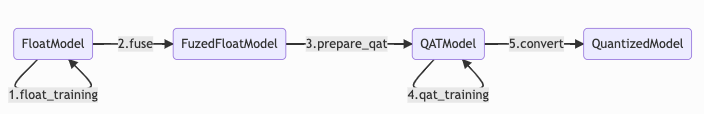

(hat-quantization)=
# 量化训练简介

> 本文档仅说明在 HAT 中进行量化训练时需要的操作，关于量化的基本原理和在训练框架中的实现方式请参阅 [`horizon_plugin_pytorch` 的相关文档](http://model.aidi.hobot.cc/api/gateway/v1/docs/latest?name=horizon_plugin_pytorch)。

在量化训练中，由浮点模型到定点模型的转换流程如下：

其中大部分步骤都已集成在 HAT 的训练 pipeline 中，用户只需注意在添加自定义模型时实现 `fuse_model` 方法来完成模型融合，且实现 `set_qconfig` 方法对量化方式进行配置即可。在编写模型时需要注意以下几点：

- HAT 只会调用最外层模块的 `fuse_model` 方法，因此在 `fuse_model` 的实现中要负责所有子模块的 fuse。
- 优先使用 `hat.models.base_modules` 中提供的基础模块，这些基础模块已实现 `fuse_model` 方法，可减少工作量和开发难度。
- 模型注册，HAT 中的各种模块全部采用了注册机制，只有将定义的模型在对应的注册项中进行注册，才可以在 config 文件中以 `dict(type={$class_name}, ...)` 的形式使用模型。
- 需要在最外层模块实现 `set_qconfig` 方法，如果子模块中有特殊layer需单独设置 QConfig，也需要在该子模块中实现 `set_qconfig` 方法，此部分细节可见 `set_qconfig 书写规范和自定义 qconfig 介绍` 章节。
- 若用户使用[FX量化]，则不需要写 `fuse_model`.

此外，为使模型可转为量化模型，需要满足一些条件，具体见 [`horizon_plugin_pytorch` 的相关文档](http://model.aidi.hobot.cc/api/gateway/v1/docs/latest?name=horizon_plugin_pytorch)。

