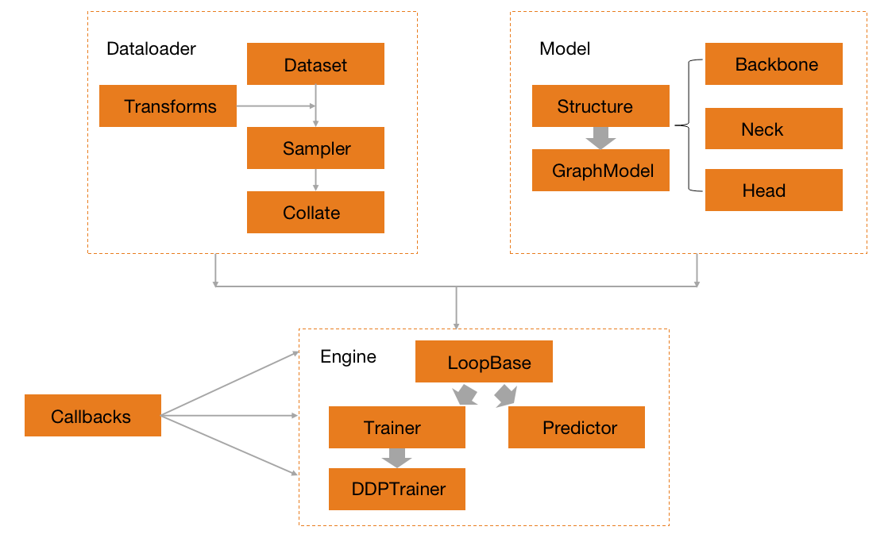
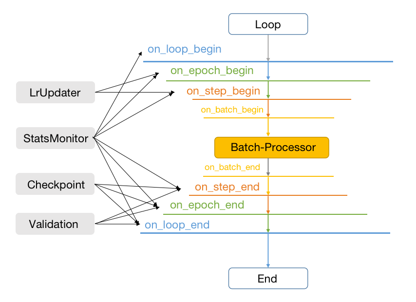
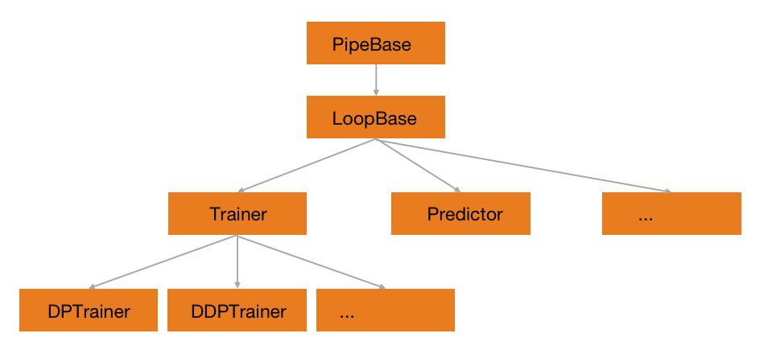

(hat-framework)=

# 框架

## HAT核心模块

上图为`HAT`框架的整体组织的抽象流程图，可以看到`HAT`是的训练和验证流程由四大核心模块组成的，分别为`Data`，`Model`，`Callback`，`Engine`。这里先分别简单地介绍一下这些核心模块。

`Data`负责`HAT`中所有的数据生产流程，包括负责迭代输出的`Dataset`，负责各项任务数据增强的`Transforms`，负责数据串联和打包batch的`Collate`，以及负责数据采样流程的`Sampler`。所有的数据生产流程最终通过`Dataloader`的接口统一的组织起来。

`Model`负责`HAT`中所有模型的搭建流程。在`HAT`中，模型一般分为`backbone`，`neck`，`head`或者`task module`等子模块，由统一的`structure`来负责串联所有的子模块完成搭建最终的模型。`structure`中除了有常见的任务之外，还有`GraphModel`专门用来处理多任务相关的模型结构搭建。

`Engine`主要负责训练或者预测的流程搭建和执行，其中训练的模块为`Trainer`，预测的模块为`Precitor`。所有的其他模块，如`Data`，`Model`，`Callback`等都会在构建完成之后输入到`Engine`中来，由`Engine`统一调度，完成训练或者预测的全部流程。

`Callback`负责在Engine执行的过程中，来动态调整训练状态的模块。其定位类似于`Torch`中模型的`Hooks`，可以在不修改`Engine`代码的情况下，根据`Engine`提供的训练状态，在指定的可修改位置上动态的调整。整个`Engine`的可修改位置主要包括：`on_loop_begin(end)`，`on_epoch_begin(end)`，`on_step_begin(end)`，`on_batch_begin(end)`。

除了核心的四大模块之外，还有其他一些辅助的模块，如`Profiler`，`Metric`，`Visualize`等。其中`Profiler`作为`HAT`的`prof`工具，主要用来辅助定位训练或者验证过程中出现的速度瓶颈。`Metric`主要用来做数据集训练或者测试过程中的指标验证，它其实是`Model`的一种特殊情况，和具体的数据集强绑定。`Visualize`主要是用来完成相关数据集的可视化工作。

## HAT构建训练流程

1. 针对任意一个数据集，构建`Data`需要的所有子模块。首先搭建用于迭代输出的`Dataset`，在迭代输出中通过`Transform`对数据进行处理，最常见的就是训练中的数据增强操作，测试中的数据预处理等。通过`Sampler`采样器控制`Dataset`的输出顺序，最终用`Collate`逐个串联，并最终完成一个`Batch`训练数据的打包。由`DataLoader`统一完成所有流程调度，并将`Batch`的训练数据作为结构，输入到训练流程中。

2. 针对任意一个模型，构建`Model`所需要的所有子模块，如`Backbone`，`Neck`等。使用`Structure`将所有的子模块串联在一起，形成一个完整的带训练状态的模型，这个模型也将作为训练对象输入到训练流程中。

3. 针对训练的任务，选择或者定义合适的`Callback`来动态调整训练过程中的训练状态。如在每次训练中定时输出训练的结果，或者每次训练中动态调整训练的学习率。虽然`Callback`的定义和`Engine`是分开的，但执行流程是嵌入到`Engine`的完整流程中。

4. 针对训练的环境，构建合适的`Engine`作为训练引擎。如常见的多卡训练环境可以选择`DistributedDataParallelTrainer`或者`DataParallelTrainer`。`Engine`可以将所有已经构建的模块，包括`Data`,`Model`，或者其他模块如`Callback`，`Metric`，`Profiler`统一的组织在一起，完成训练所需要全部环境的初始化。需要注意的是，`Engine`里面的模块并不是所有的都是必须的。

5. 最后，统一使用选择好的`Engine`中的`fit`接口，完成训练的全部流程。

以上就是`HAT`框架的整体结构和训练的抽象流程，本节开始的图不仅仅反应了构建的数据流，同时也包括模块和模块之间的调用关系。对于训练而言，最核心的部分应该就是`Engine`，全面理解`Engine`的运行流程，也就可以理解整个`HAT`的数据流。

## 执行引擎

在`HAT`中，`Engine`定义了训练和预测的整个`Pipeline`。对于任何一个深度学习的项目，对给定的模型完成训练和预测的任务是必须要完成的事情。因此本小节主要介绍`HAT`中的`Engine`模块是如何实现的。

### Engine的执行流程

整个`HAT`的Engine中，最基础的`PipeBase`定义了所有的`Callbacks`可操作的运行阶段，而`LoopBase`定义了所有`Engine`的基础执行流程。如上图所示，整个`Engine`的执行流程也就是由丰富的`Callbacks`和与模型相关的`Processor`处理两部分组成。

所有`Callbacks`可操作的运行阶段，总共可以分为`on_loop_begin`，`on_epoch_begin`，`on_step_begin`，`on_batch_begin`，`on_batch_end`，`on_step_end`，`on_epoch_end`，`on_loop_end`八个阶段。八个阶段的执行顺序如上图所示，用户可以根据自己的需要，在不同的阶段使用不同的`Callback`，当然同一个`Callback`也可以用在不同的阶段。比如常见的`LrUpdater`可以在`on_epoch_begin`和`on_step_begin`这两个阶段使用，其他部分`Callback`的作用范围亦可如图所示。

`BatchProcessor`则负责当前`Batch`中数据和模型的运行方式，包含模型常见的基本操作，如`forward`和`backward`等。除此之外，还有部分`grad`的更新操作也会被定义在这里。需要说明的是，在一些复杂的任务训练过程中，`BatchProcessor`也要求能做到更多轮次的迭代和更加丰富的`grad`操作。

### Engine结构

以`LoopBase`为基础，可以派生出丰富的执行引擎，如上图的`Engine`关系图所示。

按照功能划分，`LoopBase`可以派生出以训练为主的`Trainer`和以预测为主的`Predictor`。`Trainer`负责所有和训练相关的流程，一般的深度学习相关的训练都需要用到。`Predictor`负责和预测相关的流程，常用的使用场景如`Validation`等。

按照执行方式的不同，训练方式可以派生出不同的`Trainer`，如以`torch.nn.parallel.DistributedDataParallel`为基础的`DistibutedDataParallelTrainer`，以`torch.nn.DataParallel`为基础的`DataParallelTrainer`等等。不同的执行方式也需要不同的启动方式，具体可以参考不同`Trainer`中的`launcher`。
