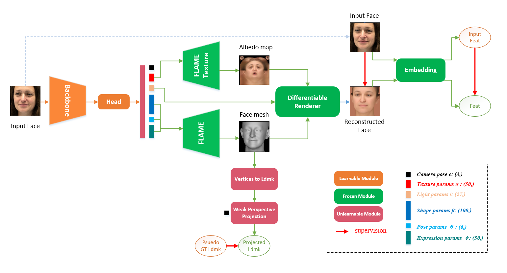

# 3D Face Reconstruction

## 算法原理

本算法方案参考了两篇论文:
- Deng Y, Yang J, Xu S, et al. Accurate 3d face reconstruction with weakly-supervised learning: From single image to image set[C]//Proceedings of the IEEE/CVF Conference on Computer Vision and Pattern Recognition Workshops. 2019: 0-0.
- Feng Y, Feng H, Black M J, et al. Learning an animatable detailed 3D face model from in-the-wild images[J]. ACM Transactions on Graphics (ToG), 2021, 40(4): 1-13.

分别来自`CVPR2019`和`SIGGRAPH2021`.

其主要流程如下图所示：



1. 人脸经过`expand`, `crop`, `resize`之后，输入`backbone`和一个`regression head`，输出236维的结果。这236维输出包括如下内容：
    - $c \in R^3$: camera pose， 这里是一个简化的相机模型参数，用于3D landmark和3D vertices投影到2D平面时的`Weak Perspective Projection`（弱透视投影）. 这3个参数分别是`scale`, `offset_x`, `offset_y`.
    - $\alpha \in R^{50}$: texture，纹理参数。用于重建人脸的`abeldo map`.
    - $l \in R^{27}$： light, 光照参数。渲染时提供光照信息.
    - $\beta \in R^{100}$: shape，人脸shape参数，用于恢复人脸结构.
    - $\theta \in R^{6}$： pose，人头的姿态参数，其中包括了`global pose`和`jaw pose`两项，而`global pose`就是业务中用到的`head pose`.
    - $\psi \in R^{50}$: expression, 人脸表情参数。用于恢复人脸的细节。

2. 人脸的shape参数$\beta$, pose参数$\theta$和表情参数$\psi$输入到`FLAME`模型之中，重建得到5023个顶点的人脸`3D mesh`.
   从人脸3D mesh可以得到人脸3D landmark 坐标，再使用相机参数$c$进行弱透视投影，得到3D landmark在2D平面上的投影`projected landmark`.
   而我们可以使用事先预刷得到的3D face landmark作为`psuedo gt landmark`对`projected landmark`进行监督.
   这里使用的是68点人脸关键点.
   >
   ---

   **NOTE**: `2D facial landmark` 和 `3D facial landmark`的区别

   以人脸68点关键点为例，2D人脸关键点与3D人脸关键点之间，除了坐标维度的区别之外，更重要的是关键点的定义区别。

   68点人脸关键点中`0-16`点分布在人脸轮廓上。随着`yaw`角度变化，2D人脸关键点的轮廓点始终是人脸可见的边缘部分，因此不同的`yaw`角度下，对应的关键点在人脸上的实际位置是不同的。与此相反，3D人脸关键点的轮廓点定义在人脸的固定位置，不随着`yaw`角度变化而变化。当`yaw`角度逐渐增大时，不可见的侧脸部分关键点会被遮挡。

   所以上述过程中是使用预刷的3D关键点（也只有x和y坐标）与投影的结果做对比。

   如果要使用2D人脸关键点，可以比较容易标注，但是从3D mesh到2D 人脸关键点的具体位置上会存在一些动态性，这些动态性会引入误差。

   当前流行的方法中，也有不少使用2D人脸关键点进行约束的，所以具体使用哪一种定义，可根据实验效果来决定。

   此外，如果预刷的关键点和FLAME模型中的关键点定义位置不太匹配，可以通过设置权重的方式忽略掉定义不匹配的点。

   ---
3. 人脸的texture参数`\alpha`输入到`FLAME Texture`模块中，得到人脸的`abedo map`.
4. 人脸的`3D mesh`, `abeldo map`, 和光照参数$l$，一起输入到一个`Differentiable Renderer`(可微分渲染器)中，得到重建的人脸。本方案中使用到了英伟达的可微分渲染库`nvdiffrast`.
5. 重建得到的人脸图像与输入图像可以求pixel-wise的loss（比如L1 loss），一般称为`photometric loss`。
    >
    ---

    **NOTE**

    pixelwise的损失会强制学习人脸区域与非人脸区域（比如背景、头发），而强行学习背景信息会对模型造成伤害，所以在求pixel wise损失的时候，需要使用一个mask指定需要求loss的区域（即人脸区域）。而这个人脸mask通常是和3D facial landmark一起通过`face parsing`的代码预刷得到的。

    为了保证重建的效果更好，我们可以重建出更高分辨率的图像。比如网络输入是(128, 128), 但是我们可以重建出(256, 256)的人脸图像。这个时候求photometric loss就不能直接使用输入图像了，就需要额外生成(256, 256)的`target_image`。代码中的`data["gt_img"]`就是这个作用。

    ---
6. 重建得到的人脸与输入图像可以送入一个特征提取网络中提取特征（即图中的`embedding`部分），这个网络可以选取事先训练好的人脸识别模型，对人脸识别模型的输出特征求`consine similarity`，从而对重建的人脸ID信息进行约束。
7. 对表情，纹理，姿态特征加上正则化。

图中橙色模块`backbone`和`head`是整个网络的可学习部分，其余的绿色模块`FLAME`, `FLAME Texture`, `Differentiable Renderer`和`Embedding`在训练时不更新参数，只做梯度传导。

在推理阶段，网络只保留橙色模块，并且只输出`head pose`.


## 训练流程

训练分为2个阶段：

1. `pretrain`阶段，该阶段使用`ImageNet pretrain`参数进行初始化，在学习的时候只计算landmark loss，只训练`float`阶段，得到一个模型。
2. `finetune`阶段，以1阶段的训练模型作为pretrain，然后正常训练`float`, `qat`。

### 开发机配置face3d环境

1. 更换GCC版本，开发机默认GCC版本为 5.4.0，需更换为7.0以上

   ```
   $ gcc -v
   gcc version 5.4.0 (GCC)
   $ which gcc
   /usr/local/gcc-5.4.0/bin/gcc
   ```

   获取GCC7.4.0并且解压缩：

   ```
   hdfs dfs -get hdfs://hobot-bigdata-aliyun/user/yuhao.dou/env/face3d/ ./
   cd face3d
   tar -xvf gcc-7.4.0.tar
   ```

   配置环境变量

   ```
   # 将gcc7.4.0路径添加到环境变量中
   在本地 ~/.bash_profile 添加  
   PATH=/home/users/PATH_NAME/face3d/gcc-7.4.0/bin:$PATH
   在本地 ~/.bashrc  添加 
   export CC=/home/users/PATH_NAME/face3d/gcc-7.4.0/bin/gcc
   export CXX=/home/users/PATH_NAME/face3d/gcc-7.4.0/bin/g++
   export LD_LIBRARY_PATH=/home/users/PATH_NAME/face3d/gcc-7.4.0/lib:$LD_LIBRARY_PATH
   export LD_LIBRARY_PATH=/home/users/PATH_NAME/face3d/gcc-7.4.0/lib/dyninst:$LD_LIBRARY_PATH
   export LD_LIBRARY_PATH=/home/users/PATH_NAME/face3d/gcc-7.4.0/lib64:$LD_LIBRARY_PATH
   export LD_LIBRARY_PATH=/home/users/PATH_NAME/face3d/gcc-7.4.0/lib64/dyninst:$LD_LIBRARY_PATH
   ```

2. 安装HAT相关环境，Pytorch版本为1.9.1，详见[install.md](https://gitlab.hobot.cc/ptd/algorithm/ai-platform-algorithm/HAT/blob/master/docs/source/quick_start/installation.md)，安装过程中如果出现pycocotools安装报错，则需要先安装cython，再重新安装。

3. 安装依赖，Ninja、fvcore和iopath

   ```
   pip install ninja fvcore iopath -i http://mirrors.aliyun.com/pypi/simple/ --trusted-host mirrors.aliyun.com
   ```
4. 安装lpips

   ```
   hdfs dfs -get hdfs://hobot-bigdata-aliyun/user/xiang.yan/Data/lpips-0.1.4-py3-none-any.whl ./
   pip install lpips-0.1.4-py3-none-any.whl
   ```

5. 安装nvdiffrast

   ```
   # 下载源码上传到开发机
   https://github.com/NVlabs/nvdiffrast
   # 解压缩并安装
   cd nvdiffrast
   pip install .
   # 安装完成后测试是否安装成功
   python samples/torch/triangle.py
   ```

6. 安装pytorch3d

   ```
   # 在第一步face3d文件夹中有pytorch3d-0.5.0版本的源码
   # 解压缩
   tar -xvf pytorch3d-0.5.0.tar.gz
   # 安装
   cd pytorch3d-0.5.0
   pip install -e .
   ```

   **注意：不能使用0.3.0及以下版本，否则会出现找不到libcudart.so.10.1的问题**
   
## 评测流程

本算法暂无评测脚本