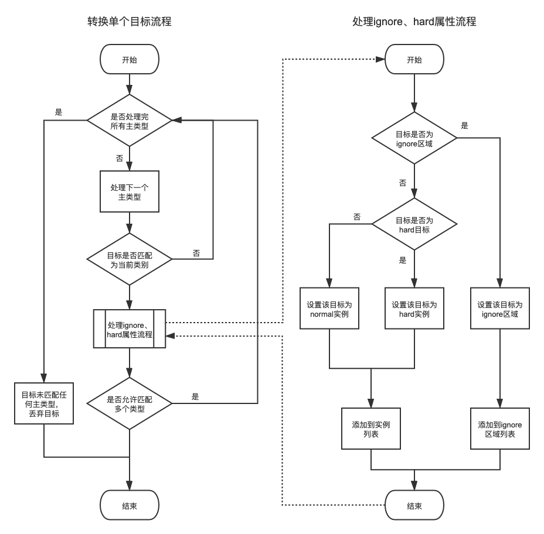
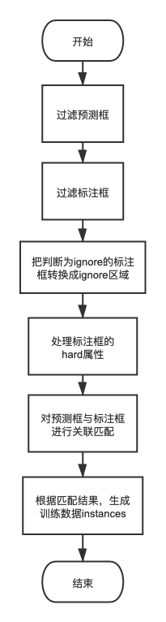

.. _pilot-data-preperation:

标注数据到训练格式的转换
==================================

.. GENERATED FROM PYTHON SOURCE LINES 11-15

.. _basic_match_intro:

基础框变换简介
----------------------------

本节主要介绍如何将标注格式的框数据转换成训练用的数据标签格式。可用于2D box目标检测或者分类。

.. GENERATED FROM PYTHON SOURCE LINES 17-60

标注格式介绍
^^^^^^^^^^^^^^^^^^^^

从标注平台下载的一张图片的框标注数据如下。 ``vehicle`` 是主类型名。其列表中的每一项是一个物体的标注对象。标注对象的 ``data`` 是包围框（`bbox`）的左（`left`）、上（`top`）、右（`right`）、下（`bottom`）坐标， ``attrs`` 中是该物体的各子类型属性。

.. code-block:: json

  {
    "image_key": "ADAS_20200806-101417_618_3__24164_1596680081513_0.jpg",
    "height": 1080,
    "width": 2048,
    "vehicle": [
      {
        "label_type": "boxes",
        "struct_type": "rect",
        "luid": "auto-5f56355ba6dfa",
        "track_id": -1,
        "attrs": {
          "confidence": "Middle",
          "Orientation": "facade",
          "occlusion": "heavily_occluded",
          "ignore": "no",
          "type": "Sedan_Car"
        },
        "data": [1055.498, 557.444, 1069, 573],
        "id": 0
      },
      {
        "label_type": "boxes",
        "struct_type": "rect",
        "luid": "auto-5f56355ba6e3a",
        "track_id": -1,
        "attrs": {
          "confidence": "Middle",
          "Orientation": "facade",
          "occlusion": "occluded",
          "ignore": "no",
          "type": "Sedan_Car"
        },
        "data": [831, 558.619, 848.512, 576],
        "id": 1
      }
    ]
  }


转换标注数据
^^^^^^^^^^^^^^^^^^^^^^^^^^^^

利用 :py:class:`hat.data.packer.transformer.detection_anno_transformer.DenseBoxDetAnnoTs` 将框标注数据转换成训练用的标注数据。其中会把所有图片中的所有目标对象映射到某个class，并标记ignore和hard等属性。

通过配置文件来定义转换规则，实例见 :ref:`packing_sample_1`。

基础设置
~~~~~~~~~~~~~~~~~~~~~~~~~

设置打包配置的全局配置

.. code-block:: yaml

  base_classname: vehicle             # 一级类型名称
  num_classes: 10                     # 打包目标类别数
  remove_empty_images: false          # 跳过不包含目标的空图片

转换目标对象
~~~~~~~~~~~~~~~~~~

对于一个标注的目标对象，首先把它归类到某个class，然后再判断是否为ignore区域。如果不是ignore区域，还需要判断它是hard的实例目标还是normal的实例目标。流程图如下



判断class
```````````````````

在config中，需要设置参数 ``num_classes`` 来定义一共有多少个class，然后通过参数 ``class_mappers`` 来定义class的转换规则。``class_mappers`` 是一个有序的列表，列表中每一项都是一个类别映射器，类别映射器中的参数 ``match_condiction`` 定义了具体的匹配条件。对于一个目标，将按顺序地依次判断它是否满足某个类别映射器的匹配条件。如果满足，则进入下一步骤判断其ignore和hard等属性。

以下是一个简单的 ``class_mappers`` 示例，主要实现了两个映射规则，首先把车型为自行车、摩托车或者朝向为横向的车辆目标映射到空类，即删除丢弃。然后把车型符合任务需求的车辆目标映射到class 5

.. code-block:: yaml

  class_mappers:                      # 目标类别转换器列表
  - id: null                              # 该类为空类，用于删除样本
    match_condiction:                         # 以下条件为真值，则目标匹配到该类别
      or:                                         # 以下列表中任一条件为真，则输出真
      - contains: {attrs: {type: Bike}}               # 包含{"attrs": {"type": "Bike"}}
      - contains: {attrs: {type: Motercycling}}       # 包含{"attrs": {"type": "Motercycling"}}
      - contains: {attrs: {type: Motorcycle}}         # 包含{"attrs": {"type": "Motorcycle"}}
      - contains: {attrs: {Orientation: Transverse}}  # 包含{"attrs": {"Orientation": "Transverse"}}
  - id: 5                                 # 类别ID
    name: rear                            # 类名，只用于展示
    match_condiction:                         # 以下条件为真值，则目标匹配到该类别
      or:                                         # 以下列表中任一条件为真，则输出真
      - contains: {attrs: {type: Sedan_Car}}          # 包含{"attrs": {"type": "Sedan_Car"}}
      - contains: {attrs: {type: Bus}}                # 包含{"attrs": {"type": "Bus"}}
      - contains: {attrs: {type: SUV}}                # 包含{"attrs": {"type": "SUV"}}
      - contains: {attrs: {type: BigTruck}}           # 包含{"attrs": {"type": "BigTruck"}}
      - contains: {attrs: {type: SmallTruck}}         # 包含{"attrs": {"type": "SmallTruck"}}
      - contains: {attrs: {type: MiniVan}}            # 包含{"attrs": {"type": "MiniVan"}}
      - contains: {attrs: {type: other}}              # 包含{"attrs": {"type": "other"}}
      - contains: {attrs: {type: Lorry}}              # 包含{"attrs": {"type": "Lorry"}}
      - contains: {attrs: {type: Special_vehicle}}    # 包含{"attrs": {"type": "Special_vehicle"}}
      - contains: {attrs: {type: Motor-Tricycle}}     # 包含{"attrs": {"type": "Motor-Tricycle"}}
      - contains: {attrs: {type: Tricycle}}           # 包含{"attrs": {"type": "Tricycle"}}
      - contains: {attrs: {type: Vehicle_others}}     # 包含{"attrs": {"type": "Vehicle_others"}}
      - contains: {attrs: {type: unknown}}            # 包含{"attrs": {"type": "unknown"}}

判断是否ignore区域
```````````````````````

在确定了目标的类型之后，还需要判断这个目标是ignore区域还是实例目标。通过类别映射器中的参数 ``ignore_condiction`` 来定义ignore的判定规则。如果它是ignore区域，那么将把它添加到该类型的ignore区域列表中。

以下是一个简单的 ``ignore_condiction`` 示例，ignore为yes的目标即为ignore区域

.. code-block:: yaml

  class_mappers:                      # 目标类别转换器列表
  ..                                      # 省略其他类别
  - id: 5                                 # 类别ID
    name: rear                                # 类名，只用于展示
    match_condiction:                         # 以下条件为真值，则目标匹配到该类别
      ..                                          # 省略具体条件
    ignore_condiction:                        # 以下条件为真值，则目标为该类的ignore区域
      contains: {attrs: {ignore: "yes"}}          # 包含{"attrs": {"ignore": "yes"}}


判断hard目标
```````````````````````

如果一个目标不是ignore区域，那么它就是实例目标。对于实例目标，还需要判断是hard目标还是normal目标。通过类别映射器中的参数 ``hard_condiction`` 来定义hard的判定规则。无论是否为hard目标，都会添加进实例目标列表中。

以下是一个简单的 ``hard_condiction`` 示例，把严重遮挡、不可见、未知车型、`bbox` 太小的目标设置为hard

.. code-block:: yaml

  class_mappers:                      # 目标类别转换器列表
  ..                                      # 省略其他类别
  - id: 5                                 # 类别ID
    name: rear                                # 类名，只用于展示
    match_condiction:                         # 以下条件为真值，则目标匹配到该类别
      ..                                          # 省略具体条件
    ignore_condiction:                        # 以下条件为真值，则目标为该类的ignore区域
      ..                                          # 省略具体条件
    hard_condiction:                          # 以下条件为真值，则目标为该类的hard目标
      or:                                         # 以下任一条件为真, 则输出真
      - contains: {attrs: {occlusion: heavily_occluded}}  # 包含{"attrs": {"occlusion": "heavily_occluded"}}
      - contains: {attrs: {occlusion: invisible}}         # 包含{"attrs": {"occlusion": "invisible"}}
      - contains: {attrs: {type: unknown}}                # 包含{"attrs": {"type": "unknown"}}
      - or:                                               # 以下所有条件为真, 则输出真
        - range: {field: $BBOX_HEIGHT, lt: 10}                # 高度 < 10
        - range: {field: $BBOX_WIDTH, lt: 10}                 # 宽度 < 10

生成点数据
`````````````````````

对于实例目标，需要把 `bbox` 坐标转换为一组点数据（`points_data`）。目标的位置、大小以及中心，通过这组点来定义。
  - p0、p1、p2、p3：包围框的四个角点，分别是左上、右上、右下、左下。
  - p4：描述了目标的中心点，通常使用包围框的中心点。如果有特殊需要，也可以把中心点定义在其他位置。
  - p5、p6、p7、p8、p9：5个构造出来的虚拟点，是通过与中心点p4的5个欧氏距离（`d`）来定义的。具体定义见下表

+-----------------+-------------------------------+---------------------------+
| point id        | 坐标                          | 与中心点欧氏距离（`d`）   |
+=================+===============================+===========================+
| p4              | (x, y)                        | 0                         |
+-----------------+-------------------------------+---------------------------+
| p5              | (x+(width*height)/2, y)       | 目标宽与高的算数平均      |
+-----------------+-------------------------------+---------------------------+
| p6              | (x+sqrt(width*height), y)     | 目标宽与高的几何平均      |
+-----------------+-------------------------------+---------------------------+
| p7              | (x+max(width, height), y)     | 目标宽与高较大者          |
+-----------------+-------------------------------+---------------------------+
| p8              | (x+max(2*width, height), y)   | 目标2倍宽与高较大者       |
+-----------------+-------------------------------+---------------------------+
| p9              | (x+max(width, 2*height), y)   | 目标宽与2倍高较大者       |
+-----------------+-------------------------------+---------------------------+

目标归一化
``````````````````````

有时需要先对图像进行平移、缩放和裁剪，再输入到模型。这是为了让目标在模型感受野中的位置和大小合适，特别是对于基于RoI图像输入的模型。这个过程成为目标归一化（`normalize`）。图像平移系数通常需要参考目标的中心位置。图像的缩放系数则通常需要参考目标的大小。目标大小如何计算是没有严格限制的。基于不同目标大小定义方式来进行目标归一化，则对应不同归一化方法（`normalize method`）。为了灵活使用，用目标两个点的欧氏距离（`d`）来表示目标大小定义方式。一些常用的归一化方法见下表

+---------------------+-----------------------+
| 归一化方法          | 目标大小定义          |
+=====================+=======================+
| height              | d(p2, p1)             |
+---------------------+-----------------------+
| width               | d(p1, p0)             |
+---------------------+-----------------------+
| diagonal            | d(p2, p0)             |
+---------------------+-----------------------+
| quar_peri           | d(p5, p4)             |
+---------------------+-----------------------+
| sqrt_area           | d(p6, p4)             |
+---------------------+-----------------------+
| max_width_height    | d(p7, p4)             |
+---------------------+-----------------------+
| max_2width_height   | d(p8, p4)             |
+---------------------+-----------------------+
| max_width_2height   | d(p9, p4)             |
+---------------------+-----------------------+

.. _packing_sample_1:

实际示例
~~~~~~~~~~~~~~~~~~~~

实例配置详见

.. code-block:: none

  projects/pilot/pack_tools/configs/rear_detection/anno_ts_config.yaml

使用方法

.. code-block:: shell

  cd projects/pilot/pack_tools
  python3 pack.py --config configs/rear_detection/train.py

.. _det_match_intro:

检测框匹配变换简介
-----------------------------------

本节主要介绍如何将标注框数据与模型预测框数据进行匹配并转换成训练用的检测任务数据标签格式。通常用于RoI图像中的2D box目标检测。标注框数据提供训练数据所需的真值（`groundtruth`），模型预测框数据提供训练过程中图像采样的RoI坐标。

.. GENERATED FROM PYTHON SOURCE LINES 236-297

标注格式介绍
^^^^^^^^^^^^^^^^^^^^^^

假设我们已经有了框标注数据，我们需要把全图检测模型的预测框加入到标注框标注数据中。做成如下格式的合并数据。其中 ``vehicle`` 和 ``vehicle_rear`` 都表示车头车尾框对象。前者是标注得到的，后者是全图模型预测框结果。类型命名上没有严格限制，不重复即可。预测框对象的 ``attrs`` 中的 ``score`` 是模型输出的置信度。

.. code-block:: json

  {
    "image_key": "20180605_182310__00023498_00.jpg",
    "height": 720,
    "width": 1280,
    "vehicle": [
      {
        "track_id": -1,
        "data": [14.222, 334.286, 214.281, 560.893],
        "attrs": {
          "ignore": "no",
          "occlusion": "occluded",
          "type": "Sedan_Car"
        },
        "struct_type": "rect",
        "id": 1
      },
      {
        "track_id": -1,
        "data": [254.104, 0, 993.642, 719],
        "attrs": {
          "ignore": "no",
          "occlusion": "occluded",
          "type": "Bus"
        },
        "struct_type": "rect",
        "id": 2
      }
    ],
    "vehicle_rear": [
      {
        "attrs": {
          "score": 0.984375,
        },
        "data": [1141.860, 320.195, 1203.830, 391.367],
        "id": 5,
        "struct_type": "rect"
      },
      {
        "attrs": {
          "score": 1.203125,
        },
        "data": [21.580, 332.366, 227.790, 553.858],
        "id": 6,
        "struct_type": "rect"
      },
      {
        "attrs": {
          "score": 0.953125,
        },
        "data": [255.030, 49.122, 1007.290, 720.0],
        "id": 7,
        "struct_type": "rect"
      }
    ]
  }

.. GENERATED FROM PYTHON SOURCE LINES 300-398

转换标注数据
^^^^^^^^^^^^^^^^^^^^^^^^^^^

利用 :py:class:`hat.data.packer.transformer.plate_anno_tranformer.DenseBoxSubboxDetAnnoTs` 将框标注数据与模型预测数据的合并数据转换成训练用的标注数据。其中会对每张图片中的标注框与预测框进行关联匹配。最后再把匹配的一对框转换成训练数据的实例对象（`instance`）。这里的 `subbox` 指的是预测框和标注框的匹配。

通过配置文件来定义转换规则，实例见 :ref:`packing_sample_2`。

基础设置
~~~~~~~~~~~~~~~~~~~~

设置打包配置的全局配置

.. code-block:: yaml

  num_classes: 10                     # 打包目标类别数
  current_class_id: 5                 # 当前类别ID，不支持生成多类别，因此需要指定一个类别
  remove_empty_images: false          # 跳过不包含目标的空图片
  children_box_classname: vehicle     # 标注框类型名，用来提供groudtruth坐标
  parent_box_classname: vehicle_rear  # 预测框类型名，用来提供采样的RoI坐标

转换目标
~~~~~~~~~~~~~~~~~~~

流程图如下



过滤标注框和预测框
````````````````````````````````````

在config中，可以设置参数 ``parent_box_remove_condiction`` 和 ``children_box_remove_condiction`` 来指定过滤掉哪些目标。如下

.. code-block:: yaml

  parent_box_remove_condiction:           # 过滤掉符合以下条件的预测框
    range: {field: attrs.score, lt: 0.18}     # obj["attrs"]["score"] < 0.18
  children_box_remove_condiction:         # 过滤掉符合以下条件的标注框
    or:                                       # 以下任一条件为真, 则输出真
    - contains: {attrs: {type: Bike}}                 # 包含{"attrs": {"type": "Bike"}}
    - contains: {attrs: {type: Motorcycle}}           # 包含{"attrs": {"type": "Motorcycle"}}
    - contains: {attrs: {Orientation: Transverse}}    # 包含{"attrs": {"Orientation": "Transverse"}}


判断标注框是否为ignore区域
``````````````````````````````````````

通过设置参数 ``children_box_ignore_condiction`` 来指定把哪些标注框转换为ignore区域。如下

.. code-block:: yaml

  children_box_ignore_condiction:
    contains: {attrs: {ignore: "yes"}}


判断标注框是否为hard
```````````````````````````````````````

通过设置参数 ``children_box_hard_condiction`` 来指定把哪些标注框是hard目标。以下是一个示例，把严重遮挡、不可见、未知车型、bbox太小的目标设置为hard

.. code-block:: yaml

  children_box_hard_condiction:               # 以下条件为真值，则目标为hard目标
    or:                                           # 以下任一条件为真, 则输出真
    - contains: {attrs: {occlusion: heavily_occluded}}    # 包含{"attrs": {"occlusion": "heavily_occluded"}}
    - contains: {attrs: {occlusion: invisible}}           # 包含{"attrs": {"occlusion": "invisible"}}
    - contains: {attrs: {type: unknown}}                  # 包含{"attrs": {"type": "unknown"}}
    - or:                                                 # 以下所有条件为真, 则输出真
      - range: {field: $BBOX_HEIGHT, lt: 10}                  # 高度 < 10
      - range: {field: $BBOX_WIDTH, lt: 10}                   # 宽度 < 10


关联匹配目标
``````````````````````````````````````

对标注框与预测框进行关联匹配，有多种匹配模式，这里以 ``matching_with_overlaps`` 为例。首先需要计算所有预测框与所有标注框之间的 `IoU`。得到 `IoU` 矩阵，然后进行利用二分图匹配，尽可能把 `IoU` 高预测框和标注框匹配到一起。并计算标注框和预测框的 `IoD` （Intersection Over Detection），最后放弃 `IoD` 低于阈值 ``matching_with_overlaps`` 的匹配结果。config示例如下

.. code-block:: yaml

  match_mode: matching_with_overlaps  # 匹配模式
  match_overlap_threshold: 0.8        # 匹配的IoU阈值

生成目标实例
```````````````````````````````

如果一个标注框与一个预测框匹配成功了，那么就会生成一个训练数据用的实例对象（`instance`）。其中标注框提供包围框真值（`groundtruth`）坐标，预测框提供训练图像采样的RoI坐标。

生成点数据
```````````````````````````

在 :ref:`basic_match_intro` 中通过设置一组10个点来定义目标的位置、大小以及中心。而在当前的 `检测框匹配变换` 模式中，产生的实例目标需要同时包含模型预测框和标注框两部分信息。因此设置一组20个点，前10个点对应模型预测框，后10个点对应标注框。

.. _packing_sample_2:

实际示例
~~~~~~~~~~~~~~~~~~~~~~~~~~

实例配置详见

.. code-block:: none

  projects/pilot/pack_tools/configs/rear_detection/anno_ts_config.yaml

使用方法

.. code-block:: shell

  cd projects/pilot/pack_tools
  python3 pack.py --config configs/rear_detection/train.py --num-worker 8 --visualize

分类框匹配变换简介
-------------------------------------

类似 :ref:`det_match_intro`，对标注框数据与模型预测框数据进行匹配并转换成训练用的分类任务数据标签格式。

.. GENERATED FROM PYTHON SOURCE LINES 407-410

标注格式介绍
^^^^^^^^^^^^^^^^^^^^

与 :ref:`det_match_intro` 中的数据格式一样

.. GENERATED FROM PYTHON SOURCE LINES 412-533

转换标注数据
^^^^^^^^^^^^^^^^^^^^

利用 :py:class:`hat.data.packer.transformer.detection_anno_transformer.DenseBoxDetAnnoTs` 将框标注数据与模型预测数据的合并数据转换成训练用的标注数据。其中会对每张图片中的标注框与预测框进行关联匹配。最后再把匹配的一对框转换成训练数据的实例对象（`instance`）。

通过配置文件来定义转换规则，实例见 :ref:`packing_sample_3`。

基础设置
~~~~~~~~~~~~~~~~~~~~~~~

设置打包配置的全局配置

.. code-block:: yaml

  num_classes: 5                      # 打包目标类别数
  remove_empty_images: false          # 跳过不包含目标的空图片
  children_box_classname: vehicle     # 标注框类型名，用来提供groudtruth坐标
  parent_box_classname: vehicle_rear  # 预测框类型名，用来提供采样的RoI坐标

转换目标
~~~~~~~~~~~~~~~~~~~~~~

过滤预测框
`````````````````````

在config中，可以设置参数 ``parent_box_remove_condiction`` 来指定过滤掉哪些预测框。如下

.. code-block:: yaml

  parent_box_remove_condiction:           # 过滤掉符合以下条件的预测框
    range: {field: attrs.score, lt: 0.18}     # obj["attrs"]["score"] < 0.18


判断标注框是否ignore区域
```````````````````````````````````````

通过设置参数 ``children_box_ignore_condiction`` 来指定把哪些标注框转换为ignore区域。如下

.. code-block:: yaml

  children_box_ignore_condiction:
    contains: {attrs: {ignore: "yes"}}

判断预测框是否在ignore区域内
```````````````````````````````````````

如果预测框与某个ignore区域的 `IoD` 大于阈值 ``min_ignore_overlap``，则认为预测框在ignore区域内，不参与训练。

.. code-block:: yaml

  min_ignore_overlap: 0.5             # 预测框与某ignore区域的IoD阈值，则预测框在ignore区域内

判断标注框的类别
`````````````````````````````````````

类似 `基础框变换` 通过设置参数 ``class_mappers`` ，对非ignore区域的标注框标记类别。config如下

.. code-block:: yaml

  class_mappers:                      # 目标类别转换器列表
  - id: 5                                 # 类别ID
    name: unknown                         # 类别名称，无实际作用
    match_condiction:                         # 以下条件为真值，则目标匹配到该类别
      or:                                         # 以下列表中任一条件为真，则输出真
      - contains: {attrs: {type: Bike}}               # 包含{"attrs": {"type": "Bike"}}
      - contains: {attrs: {type: Motorcycle}}         # 包含{"attrs": {"type": "Motorcycle"}}
  - id: 1
    name: full_visible
    match_condiction:
      or:
      - contains: {attrs: {occlusion: full_visible}}  # 包含{"attrs": {"occlusion": "full_visible"}}
  - id: 2
    name: occluded
    match_condiction:
      or:
      - contains: {attrs: {occlusion: occluded}}      # 包含{"attrs": {"occlusion": "occluded"}}
  - id: 3
    name: heavily_occluded
    match_condiction:
      or:
      - contains: {attrs: {occlusion: heavily_occluded}}  # 包含{"attrs": {"occlusion": "heavily_occluded"}}
  - id: 4
    name: invisible
    match_condiction:
      or:
      - contains: {attrs: {occlusion: invisible}}     # 包含{"attrs": {"occlusion": "invisible"}}

关联匹配目标
`````````````````````````````````

对标注框与预测框进行关联匹配，首先需要计算所有预测框与所有标注框之间的 `IoU`。逐个地检查预测框，如果预测框与所有标注框 `IoU` 最大的一个的 `IoU` 大于阈值 ``min_match_iou``，那么该预测框匹配到 `IoU` 最大的标注框。

.. code-block:: yaml

  min_match_iou: 0.55                 # 预测框与标注框的匹配IoU阈值

生成目标实例
`````````````````````````````````

如果一个标注框与一个预测框匹配成功了，那么就会生成一个训练数据用的实例对象（`instance`）。其中标注框提供分类真值（`groundtruth`）类别，预测框提供训练图像采样的RoI坐标。

处理没匹配的预测框
`````````````````````````````````

如果预测框与所有标注框的 `IoU` 小于 ``max_fp_iou`` ，那么标记该预测框为 `fp` 框。并且转换为 ``fp_id`` 类别。

.. code-block:: yaml

  max_fp_iou: 0.35                    # 预测框与所有标注框低于这个阈值，则标记为fp框
  fp_id: 5                            # 被标记为fp的预测框，将转换到fp_id类别

生成点数据
`````````````````````````````

生成与 :ref:`basic_match_intro` 中相同的10个点来定义目标的位置、大小以及中心。


.. _packing_sample_3:

实际示例
~~~~~~~~~~~~~~~~~~~~~~~~~

实例配置详见

.. code-block:: none

  projects/pilot/pack_tools/configs/vechicle_category_classification/anno_ts_config.yaml

使用方法

.. code-block:: shell

  cd projects/pilot/pack_tools
  python3 pack.py --config configs/vechicle_category_classification/train.py

.. GENERATED FROM PYTHON SOURCE LINES 536-540

分割：标注变换简介
-------------------------------------

本节主要介绍如何将分割标注数据转换成训练用的格式。

.. GENERATED FROM PYTHON SOURCE LINES 542-633

标注格式介绍
^^^^^^^^^^^^^^^^^^^^^^^

如下是分割标注格式：

.. code-block:: none

    "image_key":"ADAS_20190626-223203_974__00023600_01_render.jpg",
    "video_name":"1",
    "video_index":"165",
    "width":1280,
    "height":720,
    "parsing":[
        {
            "id":0,
            "track_id":-1,
            "struct_type":"parsing",
            "attrs":{
                "type":"pole",
                "ignore":"no"
            },
            "data":[
                [
                    "180.282",
                    "190.264"
                ],
                [
                    "226.354",
                    "198.275"
                ],
                [
                    "223.349",
                    "332.462"
                ],
                [
                    "226.354",
                    "328.456"
                ],
                [
                    "233.365",
                    "325.452"
                ],
                [
                    "235.368",
                    "254.353"
                ],
                [
                    "237.371",
                    "189.263"
                ],
                [
                    "182.285",
                    "186.259"
                ]
            ],
            "point_attrs":[
                null,
                null,
                null,
                null,
                null,
                null,
                null,
                null
            ]
        },
    ]

分割的标注有如下2种方式，这两种方式的原始标注数据的个数、内容略有不同：

- 第一种是直接在图片上标注

  - 原始标注数据包含：原图、标注的 ``json`` 文件

  - 标注的 ``json`` 文件包含以下内容：

    - 图片信息：原图的文件名 ``image_key`` ，以及图片的长宽等

    - 标注信息：在 ``parsing`` 键中有该张图所有域的信息，重点关注属性 ``attrs`` 和标注点
      ``data`` 信息， ``attrs`` 中给出标注域的类别和是否ignore该域， ``data`` 中给出该域的外轮廓点坐标

- 第二种是在预刷结果上标注，即打补丁标注

  - 原始标注数据包含：原图、标注的 ``json`` 文件、预刷结果的label map、预刷结果的render map（渲染图）

  - 标注的 ``json`` 文件包含以下内容：

    - 图片信息： ``image_key`` 是render map的文件名，其余同第一种标注方式

    - 标注信息：同第一种标注方式

- 注：分割数据前期标注是第一种方式，后期为方便标注和减少成本采用第二种标注方式

.. GENERATED FROM PYTHON SOURCE LINES 635-667

生成label map
^^^^^^^^^^^^^^^^^^^^^^^^^^^^^^

利用 :py:class:`hat.data.packer.transformer.segmentation_anno_transformer.DefaultGenerateLabelMapAnnoTs` 将分割标注转换成一张label map。

确定类别映射
~~~~~~~~~~~~~~~~~~~~~~~~~

分割标注是40类标注（38个确定属性类别 + 1个其他属性类别other + 1个掩膜类别，类别定义可以参考标注文档），而实际应用中
会将某些类别进行合并，即类别映射。类别映射关系由 ``目标类别`` 和 ``类别映射配置文件`` 确定，
如目标类别是 ``12.5`` （指12类第5个版本，名称自定义），对应的类别映射配置文件是
``parsing_labelmap_12cls_v5.py``，配置格式如下：

.. code-block:: none

    dst_label['car'] = 3   # car、truck、bus、train、tricycle 这几个类别合并为一个类别且label数值是3
    dst_label['truck'] = 3
    dst_label['bus'] = 3
    dst_label['train'] = 3
    dst_label['tricycle'] = 3

生成label map
~~~~~~~~~~~~~~~~~~~~~~~~

- 首先获取 ``label map底图``
  - 如果是第二种标注方式则通过 ``image_key`` 找到预刷模型的label map作为 ``label map 底图``。
  - 如果是第一种标注方式，则会找不到预刷的label map文件，那么会生成一个全0的数组作为 ``label map 底图``。

- 再从标注json文件中读取标注点，通过 ``draw_contours`` 函数在底图上得到对应域的label值。
  将标注json文件全解析后，最终全图的每个pixel都会有label值，即分割的label map。其中
  ``draw_contours`` 处理包含以下两点：
  - 读取标注json中的标注域外轮廓点的坐标值（在 ``data`` 里）
  - 根据类别映射关系，赋予该域label值，如果 ``attrs`` 中 ``ignore`` 属性值为 ``yes`` ，
  则将该域label值置为255。
