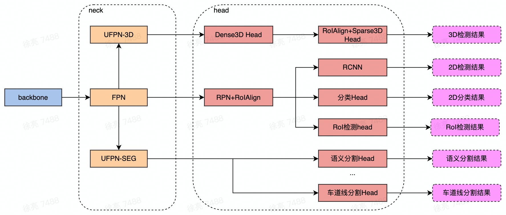

.. _pilot-model-structure:

模型结构
===========================================================

Pilot中的算法任务，最终被放在两类模型中，分别为：LEGORCNN多任务模型，图像质量单任务模型。

* ``LEGORCNN多任务模型`` ：输出分割、目标检测、3D检测、roi检测、分类和角点检测结果。

  在多任务模型中，各任务按照模型结构可分为两类：

  * 单阶段任务：直接基于完整图像得到感知结果的任务，主要包括：语义分割、车道线分割

  * 二阶段任务：首先基于完整图像得到全图特征和RoI信息，再通过RoIAlign从全图特征中抠出RoI对应的特征，得到最终感知结果。 主要包括：对车辆、行人、骑车人的检测以及相应的分类、识别（车型分类、车辆遮挡分类、行人朝向分类）等任务。
    其中，共享RoI信息的部分二阶段任务可被视为一个多任务组，如全车多任务、行人多任务等。

* ``图像质量单任务模型`` ：输出全图的图像质量语义分割结果。

LEGORCNN多任务模型
~~~~~~~~~~~~~~~~~~~~~~~~~~~~~~~~~~~~~~~~~~~~~~~

LEGORCNN多任务模型，包括Backbone、Neck、Head三类组件。

其中Backbone只有一个，所有任务共享这部分参数，Backbone用于提取所有下游任务需要使用的特征。
Neck根据不同的任务数可以有多个。Neck用于混合特征，一般同类别的任务会共享Neck，比如语义分割和车道线分割共享UFPN-SEG。
Head每个任务独享，Head用于转换特征到对应任务需要输出的内容上，是每个任务差异化的参数。

图像质量单任务结构
~~~~~~~~~~~~~~~~~~~~~~~~~~~~~~~~~~~~~~~~~~~~~~~

由于图像质量任务单独在一个模型中运行，因此结构与普通的分割任务完全一致。可参考上一章中， :ref:`pilot-seg-task` 的介绍，在此不再重复。
