.. _pilot-algo-method:

感知算法各任务方案介绍
===========================================================

Pilot周视感知算法包含的任务大体可分为两大类：

* 检测类：2D目标检测、目标分类、RoI检测、车轮接地线检测和3D目标检测
* 分割类：语义分割

.. note::
    本文档的图例说明：

    * 黑色实线箭头: 训练和推理均存在的流程

    * 黑色虚线箭头: 仅存在于训练的流程

    * 红色实线箭头: 仅存在于推理的流程

检测类任务
------------------------------------------

所有的检测类任务都使用 `Faster RCNN <https://arxiv.org/pdf/1506.01497.pdf>`_ 提出的二阶段方法，
即第一阶段先得到检测框（RoI），第二阶段再在第一阶段检测框的基础上输出相应的预测结果。在 ``HAT`` 内部对应的实现是 :py:class:`~hat.models.structures.detectors.two_stage.TwoStageDetector`。

检测类任务包含的组件有：主干网络（backbone+neck），第一阶段检测器RPN，第二阶段的预测器（如RCNN），decoder，以及训练时的target生成器。

主干网络的作用是对输入的原始图片做特征提取。

而RPN作为检测架构的第一阶段，作用是基于AnchorBox输出第一阶段检测结果。

主干网络和RPN连在一起后，其结构可以表示为：

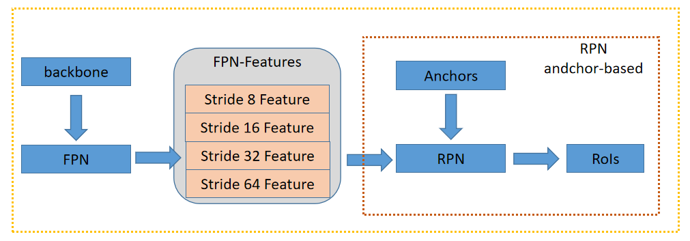

而RPN内部各模块的数据流关系则可以表示为：

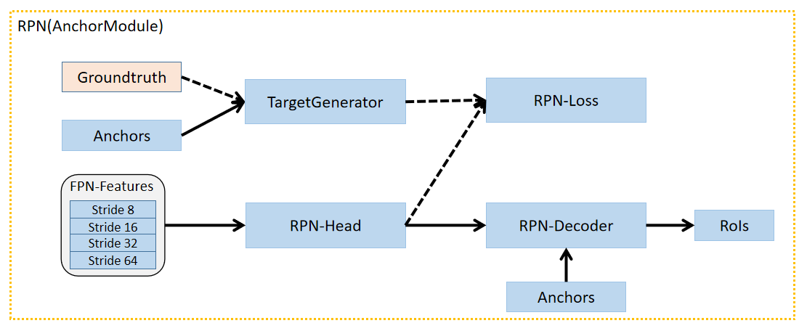

RPN在 ``HAT`` 内的实现请参考 :py:class:`~hat.models.task_modules.anchor_module.AnchorModule`。

而所有任务第二阶段的预测器基于同样的抽象结构实现，接口内容请参考 :py:class:`~hat.models.task_modules.roi_module.RoIModule`。
其内部组件的具体实现则在接下来的各任务内详细介绍。

2D目标检测
~~~~~~~~~~~~~~~~~~~~~~~~~~~~~~~~~~~~

RCNN
^^^^^^^^^^^^^^^^^^^^^^^^^^^^^^^^^^^^

RCNN作为检测架构的第二阶段，以第一阶段的检测结果作为输入，预测输出基于检测框的第二阶段结果(可以是进一步refine的检测框，也可以是检测框的属性任务[分类，子框检测等])。

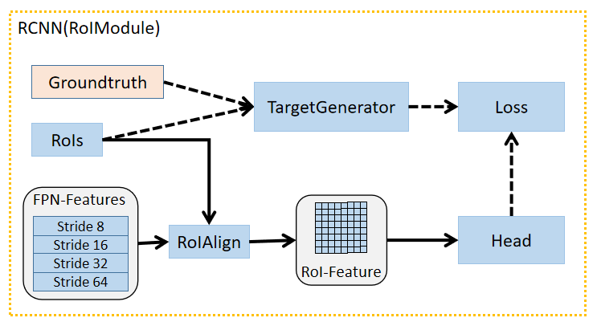

decoder
^^^^^^^^^^^^^^^^^^^^^^^^^^^^^^^^^^^^

* 解码器作用于各任务Head的输出Feature，将输出Feature解码为实际目标的结果。如下图所示。
* 输入：任务Head输出Feature(Score，BBox回归)，第一阶段的RoI
* 输出：实际目标的Score结果，BBox的左上角和右下角坐标。

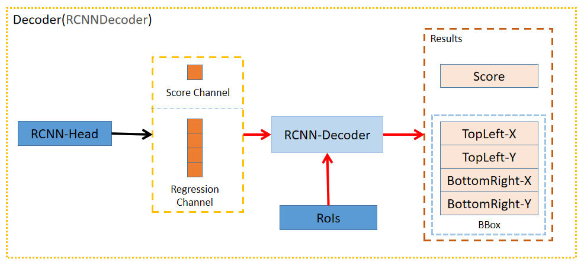

target生成器
^^^^^^^^^^^^^^^^^^^^^^^^^^^^^^^^^^^^

* target生成器用于生成模型训练目标，将训练标注转换为模型输出的target。其结果直接作用于Loss计算。如下图所示。
* 输入：训练Groundtruth(检测框的左上和右下坐标), 第一阶段的RoIs。
* 输出：计算各匹配对应Head的预测目标(Score的OneHot目标, BBox的中心点回归目标和长宽回归目标)。

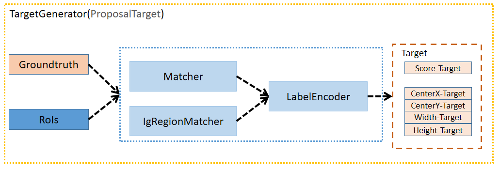

对应任务
^^^^^^^^^^^^^^^^^^^^^^^^^^^^^^^^^^^^

全图检测包含全车检测、车尾检测、行人检测、骑车人检测4个任务。

* 全车检测：输出结果为紧贴车辆边缘的矩形框，如下图蓝框所示

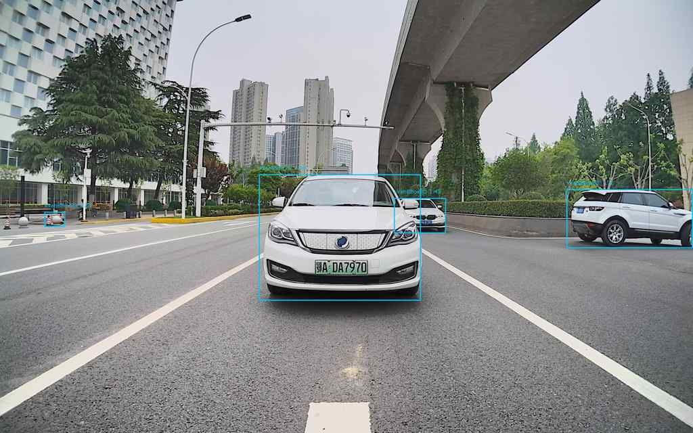


* 车头车尾检测：输出结果为紧贴车辆的车头或者车尾边缘的矩形框，如下图红色框所示

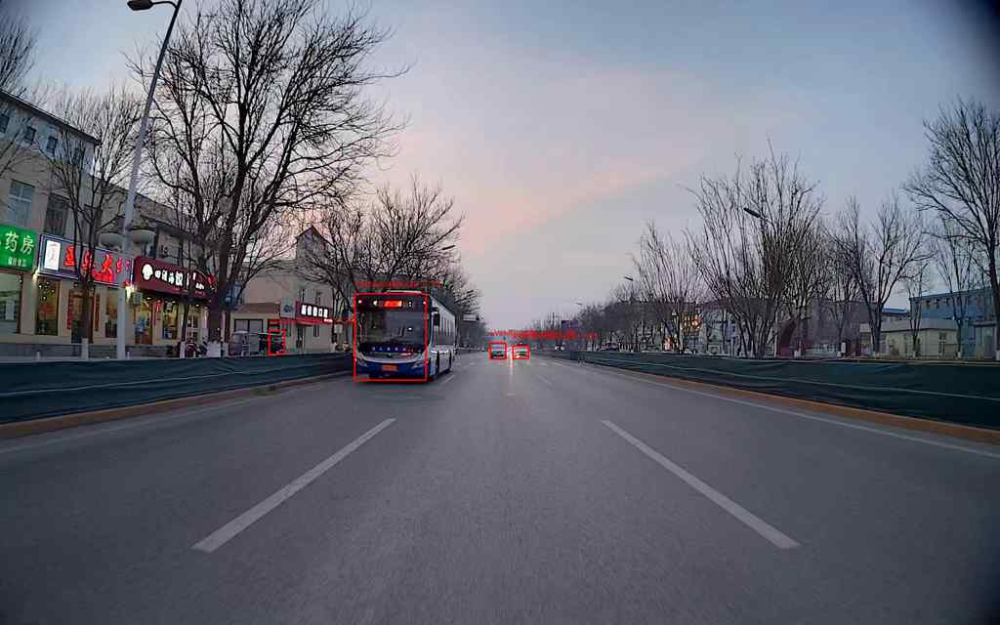

* 行人检测：输出结果为紧贴行人边缘的矩形框，如上图所示

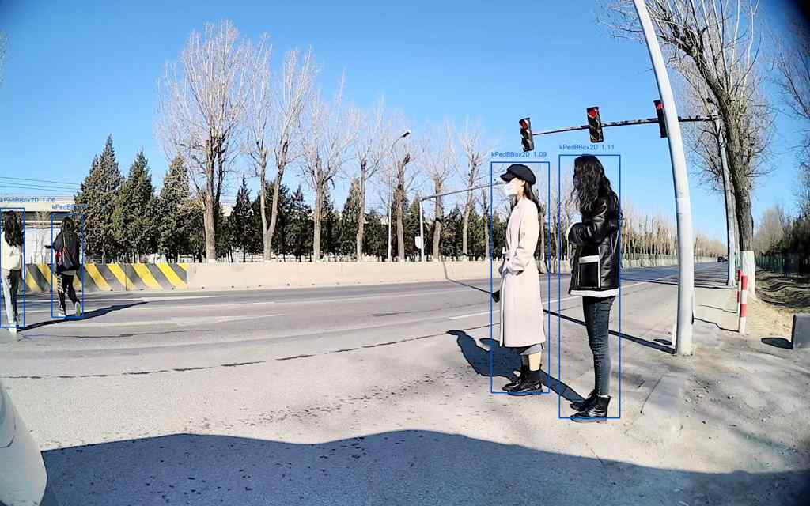

* 骑车人检测：输出结果为紧贴骑车人边缘的矩形框，如上图所示

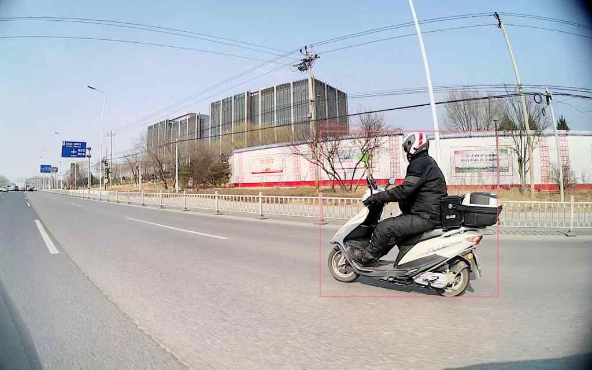

分类
~~~~~~~~~~~~~~~~~~~~~~~~~~~~~~~~~~~~

Pilot中的分类任务都是基于RoI特征的分类，通过RPN或RCNN获取RoI，经过RoIAlign获取特征，然后过分类head输出对应任务的分类结果。

RoI分类head
^^^^^^^^^^^^^^^^^^^^^^^^^^^^^^^^^^^^

基于第一阶段输出的RoIs，预测检测目标的分类结果；其Head整体结构检测任务结构基本一致，详细结构参见RCNN示例图部分，此不再赘述。

decoder
^^^^^^^^^^^^^^^^^^^^^^^^^^^^^^^^^^^^

* 根据Classification分支输出的特征，基于ArgMax解码为具体类别信息。
* 输入：Head输出的ScoreChannels
* 输出：ArgMax后的CategoryID

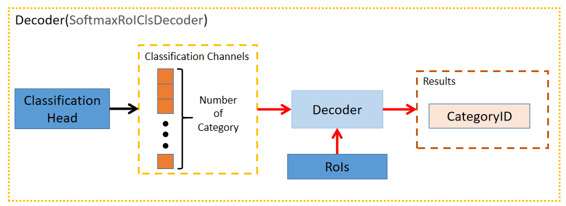

target生成器
^^^^^^^^^^^^^^^^^^^^^^^^^^^^^^^^^^^^

* target生成器作用于分类目标的训练时，构建分类Head的训练目标；其架构与RCNN的基本一致，如下图所示。
* 输入：训练Groundtruth(检测框的左上和右下坐标、检测框类别), 第一阶段的RoIs。
* 输出：计算分类Head的预测目标(类别的OneHot编码)。

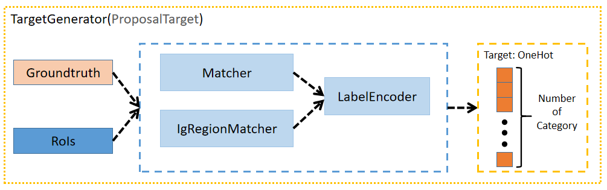

对应任务
^^^^^^^^^^^^^^^^^^^^^^^^^^^^^^^^^^^^

分类任务包含车型分类，全车遮挡分类，车辆截断分类，车头车尾分类，车头车尾遮挡分类，行人年龄分类，行人朝向分类，行人姿态分类，行人遮挡分类

* 车型分类：输出结果为全车检测框中目标的类别属性：巴士、中型车、卡车、三轮车、微型车、皮卡、异型车（油罐车、拖挂车、挖掘机）

* 全车遮挡分类：输出结果为全车检测框中目标的遮挡程度属性：完全可见、部分遮挡、严重遮挡、不可见

* 车辆截断分类：支持类别共4类：无截断、轻度截断、中度截断，重度截断

* 车头车尾分类：输出结果为车头车尾检测框中目标的类别属性：车头、车尾、未知

* 车头车尾遮挡分类：输出结果为车头车尾检测框中目标的遮挡程度属性：全部可见，部分遮挡，严重遮挡，完全不可见

* 行人年龄分类：输出结果为行人检测框中目标的年龄类别属性：成人，小孩 2个类别。

* 行人朝向分类：输出结果为行人检测框中目标的方向类别属性：后, 前，左，左前，左后，右，右后，右前 8个类别。

* 行人姿态分类：出结果为行人检测框中目标的类别属性：弯腰的人，骑车的人，躺着的人，行走的人，坐着的人 5个类别。

* 行人遮挡分类：输出结果为行人检测框中目标的姿态类别属性：全部可见，部分遮挡，严重遮挡，完全不可见 4个类别。

2D RoI检测
~~~~~~~~~~~~~~~~~~~~~~~~~~~~~~~~~~~~
RoI检测任务是在检测框和全图feature map的基础上，通过RoIAlign来得到Score与offset。用于得到检测框内的唯一或多个子框。

RoI检测head
^^^^^^^^^^^^^^^^^^^^^^^^^^^^^^^^^^^^

基于RoI输入，Head输出一个或多个检测子框(因任务而异)。其Head整体结构检测任务结构基本一致，详细结构参见RCNN示例图部分，此不再赘述。

decoder
^^^^^^^^^^^^^^^^^^^^^^^^^^^^^^^^^^^^

* 解码器作用于RoI检测Head的输出，将输出Feature解码为实际检测目标Score和坐标。其结构如下图所示。
* 输入：Head输出的HeatMap特征，坐标回归的特征图。
* 输出：子框的得分和左上右下坐标。

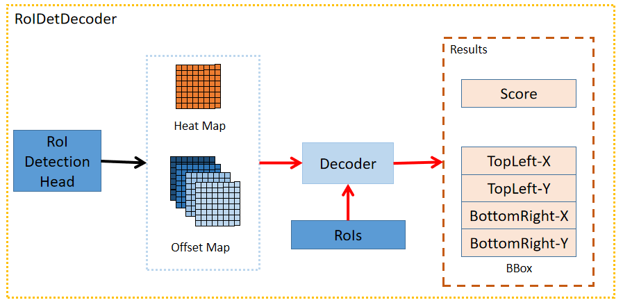

target生成器
^^^^^^^^^^^^^^^^^^^^^^^^^^^^^^^^^^^^

基于RoIs和GT匹配结果，计算子框检测的模型训练目标。其结构如下图所示。
* 输入：训练Groundtruth(子框的左上和右下坐标), 第一阶段的RoIs。
* 输出：计算子框检测Head的预测目标，包括HeatMap预测目标以及各子框的左上和右下角回归目标。

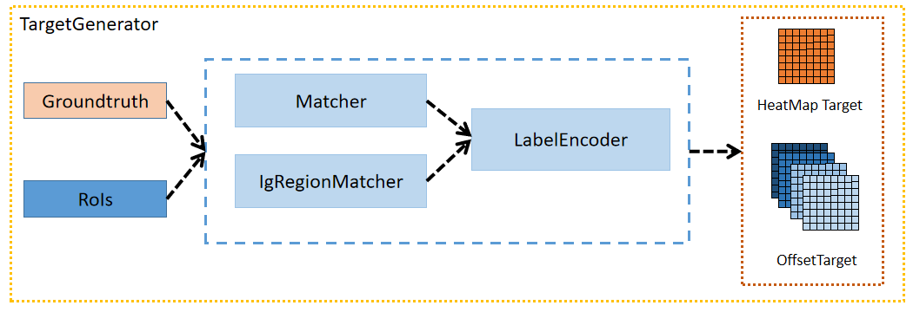

对应任务
~~~~~~~~~~~~~~~~~~~~~~~~~~~~~~~~~~~~~~

RoI检测包含车轮检测，车牌检测，人脸检测3个任务

* 车轮检测：车轮检测基于全车框的RoI，由于每辆车通常有超过一个车轮，因此多数情况下每个车辆目标会输出多个车轮框。具体输出几个车轮框，会通过阈值、位置关系等策略来进行控制。
    输出结果为紧贴车轮边缘的矩形框，如下图黄色框所示

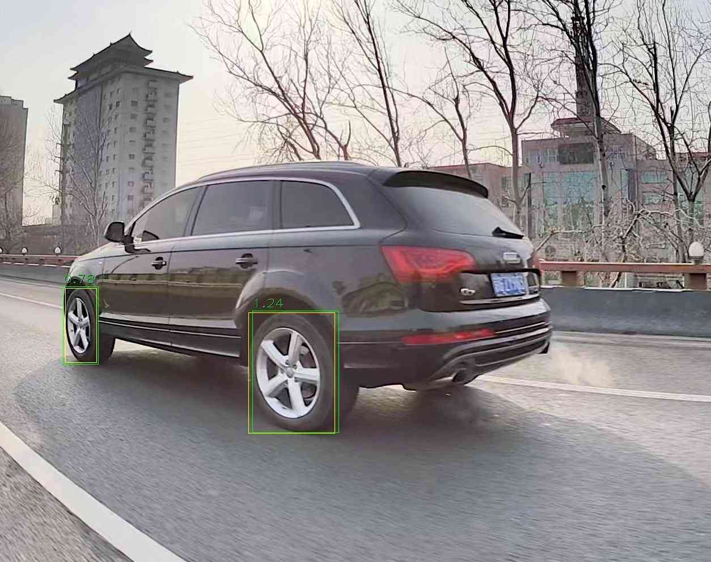

* 车牌检测：车牌检测基于车头车尾框的RoI，每个RoI内的车牌框取argmax，然后卡阈值判断是否输出。
    输出结果为紧贴车牌边缘的矩形框，如下图黄色框所示

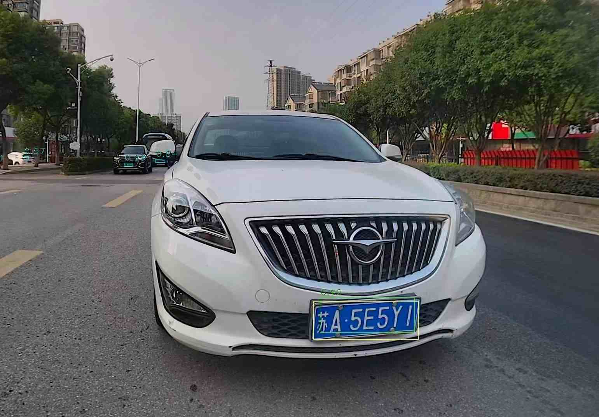

* 人脸检测：人脸检测基于人体框的RoI，每个RoI内的人脸框取argmax，然后卡阈值判断是否输出。
    输出结果为紧贴人脸边缘的矩形框，如下图蓝色框所示

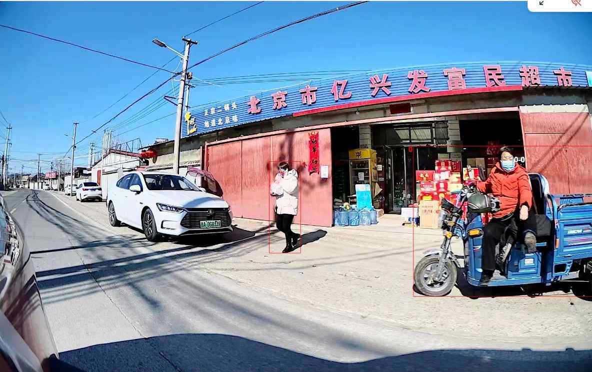

数据格式
~~~~~~~~~~~~~~~~~~~~~~~~~~~~~~~~~~~~~~

RoI检测任务的标注格式为:

.. code-block:: python

   {
       "height": 1280,
       "width": 2048,
       "image_key": "ADAS_20220528-210507_413_4__271005_1653743314199_0_extra.jpg",
       "belong_to": [
           "vehicle|1:common_box|1001"
       ],
       "vehicle": [
           {
               "attrs": {
                   "confidence": "Middle",
                   "ignore": "no",
                   "occlusion": "full_visible",
                   "part": "full",
                   "truncation": "None",
                   "type": "MiniVan"
               },
               "data": [1231.983, 651.459, 1398.638, 755.543],
               "id": 1,
               "label_type": "boxes",
               "struct_type": "rect",
               "track_id": -1
           }
       ],
       "common_box": [
           {
               "attrs": {
                   "ground_connecting": "yes",
                   "ignore": "yes",
                   "occlusion": "full_visible"
               },
               "data": [1231.757, 708.463, 1241.448, 743.517],
               "id": 1001,
               "label_type": "boxes",
               "struct_type": "rect",
               "track_id": -1
           }
       ]
   }

处理成训练格式为:

.. code-block:: python

   {
       "img_url": "24379_7/ADAS_20220528-210507_413_4__271005_1653743314199_0_extra.jpg",
       "img_h": 1280,
       "img_w": 2048,
       "instances": [
           {
               "points_data": [Parent_10_Points, Child_10_Points],
               "class_id": [1],
               "attribute": [],
               "is_hard": [1]
           }
       ],
       "ignore_regions": [
           {
               "left_top": [0, 0],
               "right_bottom": [10, 10],
               "class_id": [1],
           }
       ]
   }

接地线检测
~~~~~~~~~~~~~~~~~~~~~~~~
接地线检测基于全车框的RoI，回归全车侧面在地面上的投影点，用于描述车的侧面边界。

接地线检测Head
^^^^^^^^^^^^^^^^^^^^^^^^^^^^^^^^^^^^

该Head输出车辆侧面投影点所在位置的偏移量，最终解码为与全车框两侧的交点位置。其Head整体结构检测任务结构基本一致，详细结构参见RCNN示例图部分，此不再赘述。

接地线Decoder
^^^^^^^^^^^^^^^^^^^^^^^^^^^^^^^^^^^^

* 解码器将Head输出的Score和Regression值，解码接地线的两端点结果输出。其结构如下图所示。
* 输入：Head输出的Score通道, 左右端点纵向预测值。
* 输出：接地线存在的得分，接地线两侧端点的坐标。

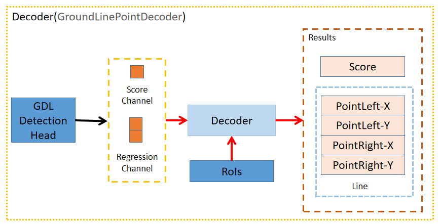

接地线target生成器
^^^^^^^^^^^^^^^^^^^^^^^^^^^^^^^^^^^^

* target生成器，以ROI和GT为输入，计算接地线Head在训练时的实际回归量，其结构如下图所示。
* 输入：训练Groundtruth(检测框的左上和右下坐标，接地线的左右端点坐标), 第一阶段的RoIs。
* 输出：计算接地线Head的预测目标，包括Score预测目标以及接地线两端点的纵向回归目标。

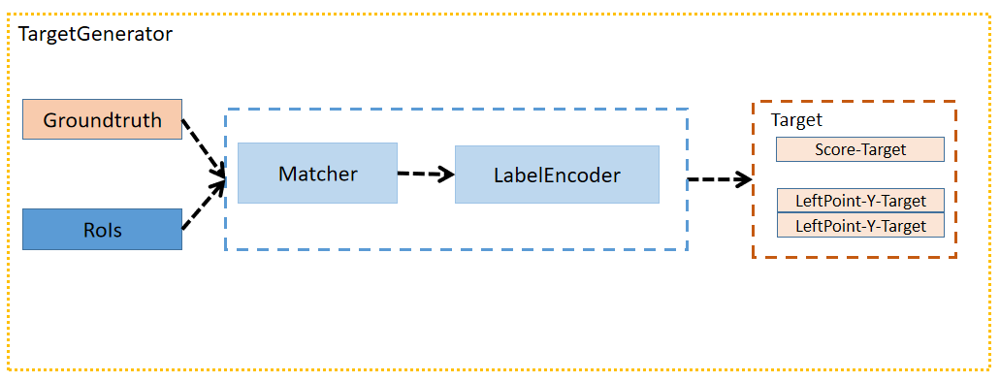

对应任务
^^^^^^^^^^^^^^^^^^^^^^^^^^^^^^^^^^

该部分只包含一个任务：接地线检测。如图所示，图中绿色直线即为接地线检测结果。

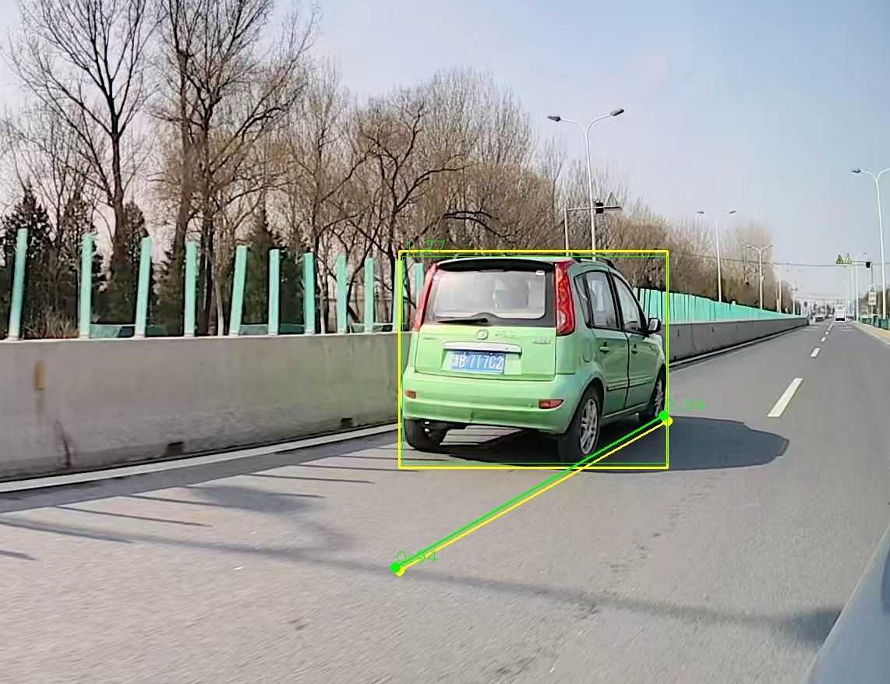

数据格式
^^^^^^^^^^^^^^^^^^^^^^^^^^^^^^^^^^

接地线检测任务的标注格式为:
沿用车辆8点的标注数据，其数据格式为

.. code-block:: python

   {
       "height": 1280,
       "width": 2048,
       "image_key": "ADAS_20220723-010516_280_1__68609_1658509518680_0_extra.jpg",
       # 根据ID描述全车框标注和关键点标注的对应关系
       "belong_to": [
           "vehicle|1:vehicle_kps_8|300001"
       ],
       "vehicle": [
           {
               "attrs": {
                   "confidence": "High",
                   "ignore": "no",
                   "occlusion": "full_visible",
                   "part": "full",
                   "truncation": "None",
                   "type": "Sedan_Car"
               },
               "data": [
                   472.164,
                   578.703,
                   953.403,
                   727.59
               ],
               "id": 1,
               "label_type": "boxes",
               "luid": "567d0a74-e045-4dea-8dd4-296d673acc53",
               "struct_type": "rect",
               "track_id": -1
           }
       ],
       "vehicle_kps_8": [
           {
               "attrs": [],
               "data": [
                   [875.839, 716.741], [607.554, 728.239],
                   [558.498, 713.956], [801.973, 703.85],
                   [940.299, 651.345], [555.467, 665.386],
                   [485.741, 657.351], [855.515, 644.794]
               ],
               "id": 300001,
               "label_type": "points",
               "luid": "auto-6311a78cce1e4",
               "num": 8,
               "point_attrs": [
                   {
                       "point_label": {
                           "Corner_confidence": "low",
                           "ignore": "no",
                           "occlusion": "full_visible",
                           "position": "other"
                       }
                   },
                   {
                       "point_label": {
                           "Corner_confidence": "low",
                           "ignore": "no",
                           "occlusion": "full_visible",
                           "position": "nearby_wheel"
                       }
                   },
                   {
                       "point_label": {
                           "Corner_confidence": "low",
                           "ignore": "no",
                           "occlusion": "self_occluded",
                           "position": "other"
                       }
                   },
                   {
                       "point_label": {
                           "Corner_confidence": "low",
                           "ignore": "no",
                           "occlusion": "self_occluded",
                           "position": "other"
                       }
                   },
                   {
                       "point_label": {
                           "Corner_confidence": "middle",
                           "ignore": "no",
                           "occlusion": "self_occluded",
                           "position": "vehicle_light_point"
                       }
                   },
                   {
                       "point_label": {
                           "Corner_confidence": "middle",
                           "ignore": "no",
                           "occlusion": "full_visible",
                           "position": "vehicle_light_point"
                       }
                   },
                   {
                       "point_label": {
                           "Corner_confidence": "low",
                           "ignore": "no",
                           "occlusion": "self_occluded",
                           "position": "vehicle_light_point"
                       }
                   },
                   {
                       "point_label": {
                           "Corner_confidence": "low",
                           "ignore": "no",
                           "occlusion": "self_occluded",
                           "position": "vehicle_light_point"
                       }
                   }
               ],
               "struct_type": "vehicle_kps_8",
               "track_id": -1
           }
       ]
   }

处理成训练格式为:

.. code-block:: python

   {
       "image": "86096_3/ADAS_20220723-010516_280_1__68609_1658509518680_0_extra.jpg",
       "height": 1280,
       "width": 2048,
       "bboxes": [
           472.164, 578.703, 953.403, 727.59, 1.0
       ],
       "flanks": [
           [558.498, 713.956, 801.973, 703.85, 1.0],
           [0.0, 0.0, 0.0, 0.0, 0.0]
       ],
       "ignore_regions": [
           {
               "left_top": [0.0, 0.0],
               "right_bottom": [2, 2.0],
               "class_id": [1.0]
           }
       ]
   }

3D目标检测
~~~~~~~~~~~~~~~~~~~~~~~~~~

与上面其他的检测类任务不同，3D目标检测实际上对应了两个任务，即dense 3d和sparse 3d。
其中dense 3d任务仅用于训练阶段3d对应的feature map学习，而sparse 3d会用于最终的推理阶段。
其整体结构可以表示为：

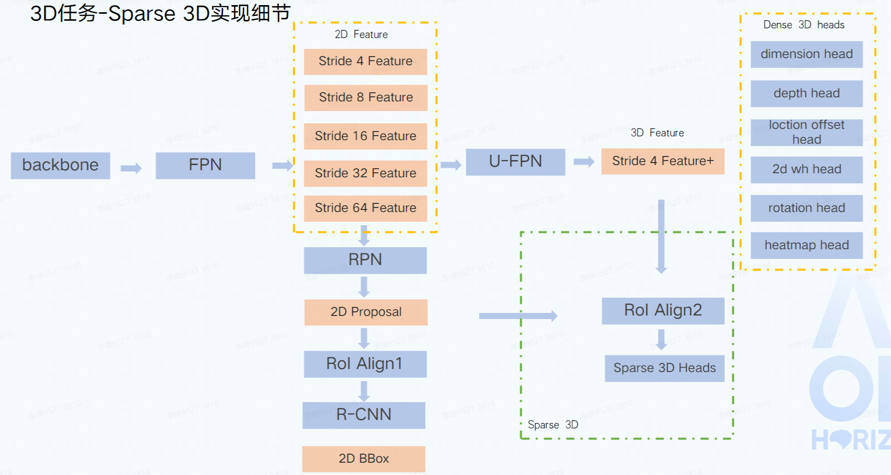


3D检测任务包含的组件有：UFPN，DenseHead，SparseHead，以及target生成器。

U-FPN
^^^^^^^^^^^^^^^^^^^^^^^^^
该模块基于Backbone输出，进一步提取3D任务的Feature。其结构如下图所示。

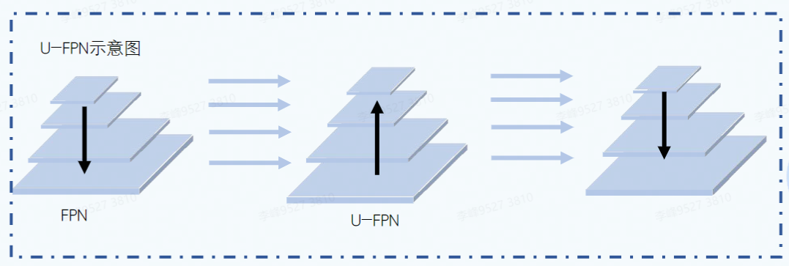

Dense 3D
^^^^^^^^^^^^^^^^^^^^^^^^^^

Head
````````````````````````

是一个多输出的全卷积网络，将feature map转化为用于生成3d目标信息的各种输出。

Sparse3D
^^^^^^^^^^^^^^^^^^^^^^^^^^^^^^^^^^^^

Head
````````````````````````

通过RoIAlign，将输入的检测框和feature map转化为用于生成3d目标信息的各种输出。

target生成器
```````````````````````

* 根据全车RoI和GT2D的匹配结果，计算3DHead回归目标。其结构如下图所示。
* 输入：训练Groundtruth(3D框的中心点坐标，长宽高，朝向角), 第一阶段的RoIs。
* 输出：计算3DHead的预测目标：投影2D中心热力图，Offset回归目标，3D中心点回归目标，深度回归值以及长宽高的回归目标。

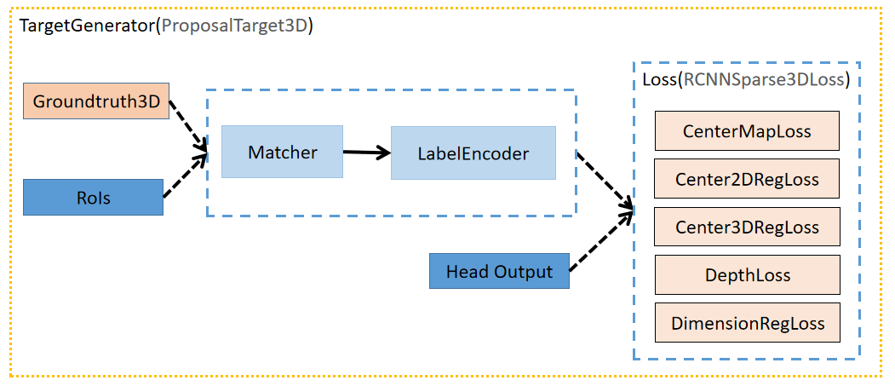

.. _pilot-seg-task:

分割类任务
------------------------------------------
 
全图分割包含语义分割，车道线分割，以及图像质量分割这3种任务。其整体模型结构为：

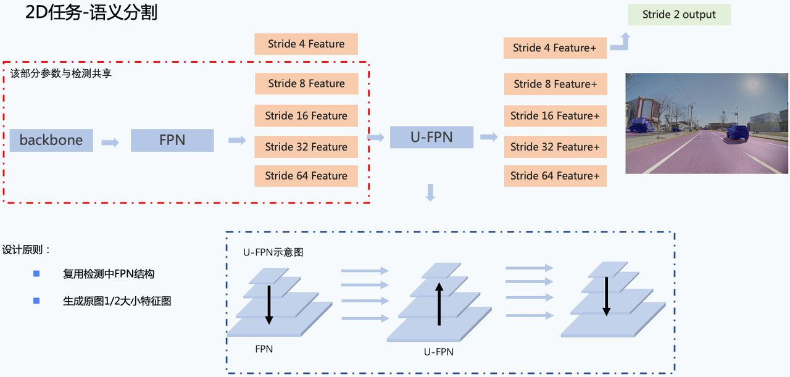

在 ``HAT`` 中对应的实现为 :py:class:`~hat.models.structures.segmentor.SegmentorV2`。


语义分割
~~~~~~~~~~~~~~~~~~~~~~~~~~~~~~~~~~~~~~


类别定义
^^^^^^^^^^^^^^^^^^^^^^^^^^^^^^^^^^^^
Pilot算法中的 ``语义分割`` （Semantic Parsing）任务共有16个类别，具体定义如下面片段所示，每个类别的渲染颜色如下colormap图所示。
输出是与输入图像尺寸完全相同的单通道标签图（uint8类型），每个像素值是该像素的类别标签，对应其所属的语义类别。
语义分割结果的用途，包括但不限于用于生成可行驶区域、确定广义路沿和施工区域，以及判断车道线的虚实线等。

语义分割对应的类别定义如下：

.. code-block:: python

    # 16类语义分割
    road           # 车道
    background     # 背景
    fence          # 围栏
    pole           # 杆子
    traffic        # 交通灯、标志牌、指路牌
    person         # 人
    vehicle        # 车辆
    two-wheel      # 两轮车
    lane_marking   # 车道线
    crosswalk      # 人行横道（斑马线）
    traffic_arrow  # 地面箭头
    sign_line      # 标志线（除车道线、导流线、人行横道、停止线和地面箭头之外的地面标志）
    guide_line     # 导流线
    cone           # 锥桶、防护柱
    stop_line      # 停止线
    speedbump      # 减速带

对应的可视化颜色：

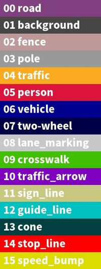

一个语义分割输出结果的可视化示例：

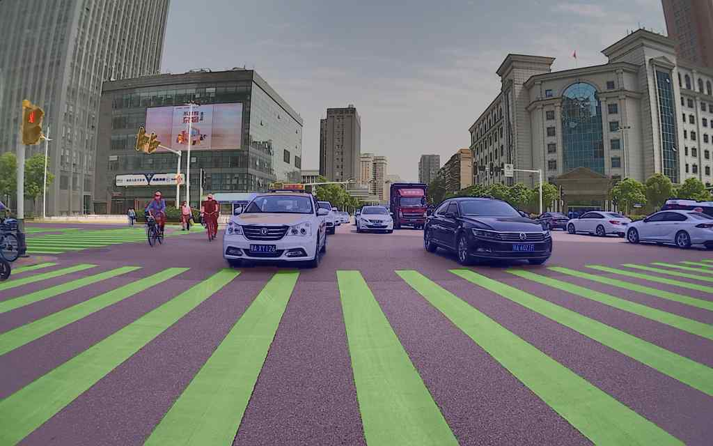

用途
^^^^^^^^^^^^^^^^^^^^^^^^^^^^^^^^^^^^
在业务场景中，语义分割的结果主要被用作生成 ``可行驶区域分割`` （Freespace Parsing）。
下图是利用语义分割结果生成的可行驶区域分割结果，可行驶区域分割以语义分割结果中的道路、
地面标志和减速带为主要对象，同时以行人、车辆、围栏和其他障碍物等作为边界，确定车辆能够行驶的区域。如上图，绿色线画出的是可
行驶区域的label，红色线画出的是模型预测输出的可行驶区域。

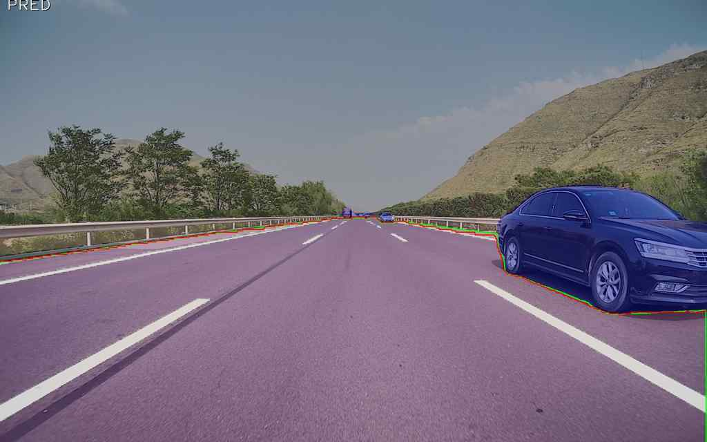

车道线分割
~~~~~~~~~~~~~~~~~~~~~~~~~~~~~~~~~~~~~~

类别定义
^^^^^^^^^^^^^^^^^^^^^^^^^^^^^^^^^^^^
Pilot``车道线分割`` （Lane Parsing）的类别如下

.. code-block:: python

    # 5类车道线分割
    background     # 背景
    lane           # 车道线
    curb           # 路沿
    double-line    # 双线
    wide           # 宽线

下图是车道线分割结果。车道线分割可用于实现车道线保持等高级辅助驾驶功能。

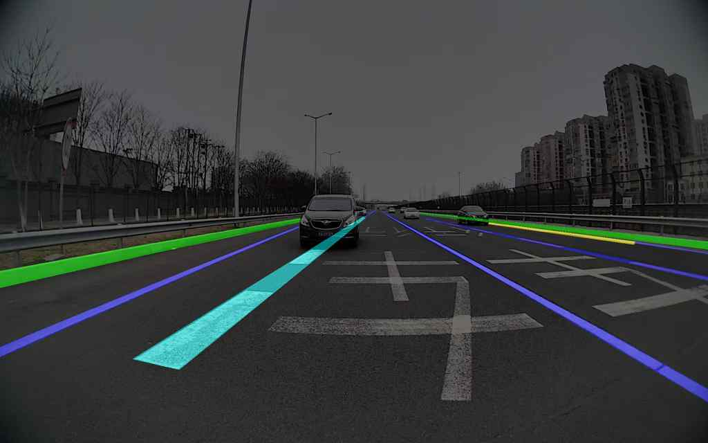

图像质量分割
~~~~~~~~~~~~~~~~~~~~~~~~~~~~~~~~~~~~~~

类别定义
^^^^^^^^^^^^^^^^^^^^^^^^^^^^^^^^^^^^
``图像质量分割`` 通过逐像素的分割，来找出图像中质量异常的区域，提供给下游做诊断功能。图像质量分割的类别定义如下：

.. code-block:: python

    # 7类图像质量分割
    normal                # 正常
    light_blur            # 轻度模糊
    heavy_blur            # 重度模糊
    light_glare           # 轻度眩光
    heavy_glare           # 重度眩光
    light_blockage        # 轻度遮挡
    heavy_blockage        # 重度遮挡

对应的可视化颜色：

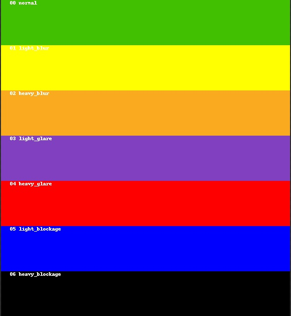

一个图像质量分割结果示例：

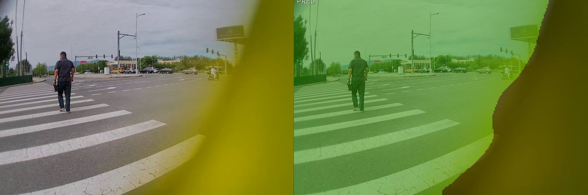

