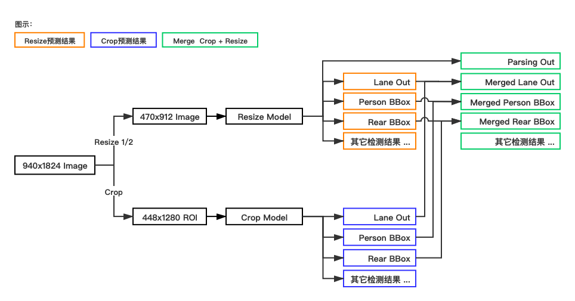
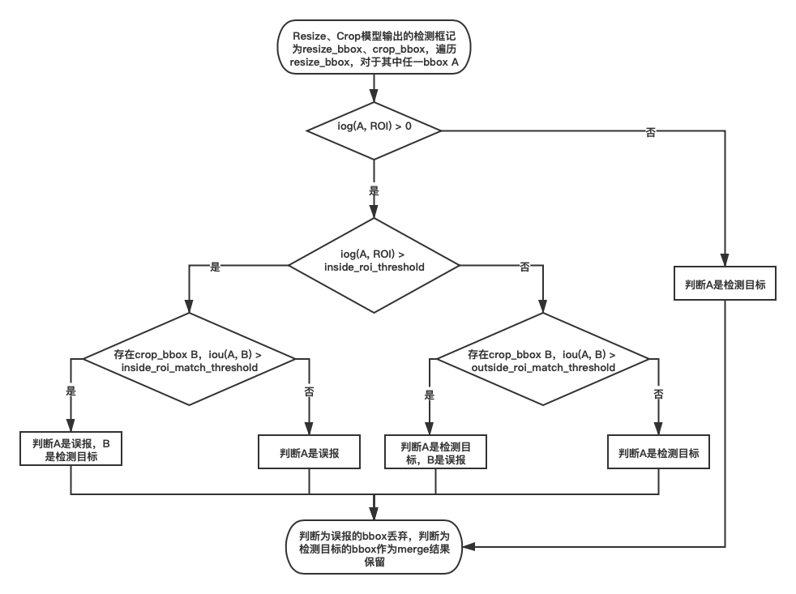

.. _pilot-algo-pipeline:

感知算法Pipeline
===========================================================

由于Pilot中有多路camera，侧视/后视在功能上有一定的偏重，其中侧视用于感知自车侧面方向的目标，和自车的行车方向平行，对距离要求一般较低；
后视用于感知自车后方的目标，在高速行车时对距离要求一般较高。基于感知距离的考虑，对LEGORCNN多任务模型设计了不同的输入

.. _legorcnn-model-type:

LEGORCNN多任务模型的种类
~~~~~~~~~~~~~~~~~~~~~~~~~~~~~~~~~~~~~~~~~~~~~~~
Pilot感知算法使用了三个LEGORCNN多任务模型，它们分别是 ``1/2 Resize`` 、 ``1/4 Resize`` 和 ``Crop`` 多任务
模型。

模型种类及定义：1/2 Resize、1/4 Resize和Crop
^^^^^^^^^^^^^^^^^^^^^^^^^^^^^^^^^^^^^^^^^^^^^^^^^

* 从大图中crop出ROI图像为输入，输出一级框检测和分割结果的4PE多任务模型称为 ``Crop多任务模型`` 。目前Crop多任务模型输出4种一级框检测和车道线分割结果（为节省算力不输出语义分割）

  * 预测阶段，ROI的大小是根据预测图片大小而定，例子中设置的大小是 ``448x1280``

  * ROI选取策略、Crop多任务模型介绍详见 `sphx_glr_build_examples_auto_matrix_legorcnn_1_1_crop.py`

* 将大图等比例resize（缩放）后作为输入，输出一级框检测和分割结果的4PE多任务模型称为 ``Resize多任务模型`` 。目前Resize多任务模型输出4种一级框检测和语义分割、车道线分割结果

  * 预测阶段，大图resize比例是1/2

  * Resize多任务模型介绍详见 `sphx_glr_build_examples_auto_matrix_legorcnn_1_0_resize.py`

Crop、Resize的输出结果只是中间结果，需要把这两个模型的预测结果先映射回原图坐标系下，然后按照 ``Merge策略`` 对这两个模型的预测结果做融合（Merge），
得到最终的4种一级框检测和语义分割、车道线分割结果。其中，Merge策略在后面 ``1/2 Resize & Crop模型的Merge策略介绍`` 小节介绍。

下图以预测一张 ``940x1824`` 图片为例，展示了上述Crop、Resize预测及Merge的流程：

Crop模型是原图分辨率输入（crop操作并未改变分辨率），而Resize模型是将原图缩小分辨率后再作为输入，因此Crop模型的检测、
分割性能会优于Resize模型。从检测结果上看，Crop模型主要负责召回远处小目标，Resize模型主要负责召回近处大目标，Crop、
Resize的配合实现在原大图上的检测、分割功能。

为什么用1/2 Resize、1/4 Resize和Crop三个模型
^^^^^^^^^^^^^^^^^^^^^^^^^^^^^^^^^^^^^^^^^^^^^^^^^^^^
（1）降低计算量，减小时延

输入图像的大小是模型计算量的瓶颈之一，以用地平线 ``J2`` 芯片预测 ``940x1824`` 大图为例，我们采用的方案一比方案二的
``Latency`` （时延）更小：

* 方案一：使用Crop、Resize ``两个`` 模型，使用双核，Crop、Resize模型各占一核， ``FPS=51.37, Latency=19.47ms``

.. code-block:: none

   Crop模型：  设定crop ROI大小是448x1280，FPS=51.37, Latency=19.47ms
   Resize模型：设定大图resize尺度是1/2，FPS=55.26, Latency=18.1ms
   注：理想情况下，整体方案的Latency是Crop、Resize中Latency较大者，及19.47ms

* 方案二：把大图直接输入 ``一个`` 模型做全图预测，使用双核，一个模型在双核上跑， ``FPS=35.48, Latency=28.18ms``

使用方案一可以有效节省计算量，降低Latency，但缺点是：

* ``指标通常不如方案二`` ，原因是：

  * 方案一需要对Crop、Resize的预测结果做Merge操作，指标的高低依赖 ``Merge策略`` 的好坏

  * 原大图中的小目标经过resize操作后面积缩小，Resize模型很难召回这些小目标，导致 ``非ROI区域`` 内的小目标可能会漏检（ROI区域的小目标即使漏检了也可由Crop模型召回）

* ``方案一比方案二多了一个4PE模型`` ，导致：

  * 软件层面的调度逻辑更复杂

  * 训练工作量翻倍，方案一需要同时训练迭代两个模型，耗费人力、GPU算力、时间

因此，当算力充沛的情况下，我们可以考虑方案二，更简单直接，指标更高，但目前为了节省算力，我们选择方案一。

1/2 Resize & Crop模型的Merge策略介绍
^^^^^^^^^^^^^^^^^^^^^^^^^^^^^^^^^^^^^^^^^^^^^^^^^^^^^

在模型预测阶段，Crop模型只在大图的ROI区域上预测（ROI大小是448x1280）、Resize模型在resize 1/2后的图像上预测，
Crop、Resize模型的预测结果映射回原图坐标系后，它们的预测结果会有 ``重合/冲突`` 的地方（例如两个模型都在ROI区域有车道线预测结果，同一个目标可能被两个模型都检测到），
下面是分割、检测任务的Merge策略：

（1）对于 ``semantic_parsing`` 语义分割，由于Crop模型不包含语义分割任务，所以Resize模型的预测结果就是merge结果。

（2）对于 ``lane_parsing`` 车道线分割，merge结果等于Crop和Resize预测结果的并集，具体实现是：

* 非ROI区域，取Resize模型的结果做为merge结果

* ROI区域，取Crop和Resize预测结果图的并集（每个像素的取值是Crop、Resize模型预测值的较大者，其中背景类id是0最小），伪代码实现：

.. code-block:: none

    输入：
    resize_pred_map:     resize模型车道线预测结果（已经映射回大图），shape = img_h x img_w （与大图一致）
    crop_pred_map:       crop模型车道线预测结果（已经映射回大图），shape = roi_h x roi_w
    roi_x, roi_y:        ROI左上角在大图上的坐标
    roi_w, roi_h:        ROI宽高

    输出：resize_pred_map ，即车道线merge结果，shape = img_h x img_w

    车道线merge逻辑伪代码：
    for nrow <-- 0 to roi_h
    do
        for ncol <-- 0 to roi_w
        do
            if crop_pred_map[nrow, ncol] > resize_pred_map[nrow + roi_y, ncol + roi_x]
                resize_pred_map[nrow + roi_y, ncol + roi_x] = crop_pred_map[nrow, ncol]
        done
    done

（3）对于 ``检测`` 任务，因为Resize模型在ROI内以及ROI边界上也有检测框，我们需要分两步合并Resize、Crop模型的检测框：

* Step 1：用下图所示流程处理Resize模型输出的检测框（bbox），去掉那些我们判断为误报的检测框，其它的作为merge结果。这一步也会去掉一部分Crop模型的检测框

  * iog(A, B) = A ∩ B / A , iou(A, B) = A ∩ B / A ∪ B

* Step 2：把剩余的Crop模型的检测框直接作为merge结果
