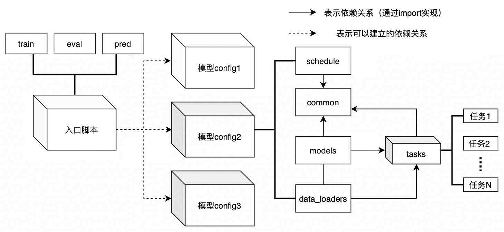

.. _pilot-config-intro:

Pilot周视算法模型config介绍
==================================

本章以类似于说明书的形式介绍Pilot周视算法模型的config的实现，主要帮助使用者对config的结构和大体内容建立初步印象。

.. note::
    阅读本教程前，请使用者先参考 :ref:`hat-registry` 和 :ref:`hat-config` 的相应内容，以对 ``HAT`` 中的模块注册机制以及config实现方式有足够的认识。

    此外，如果您想了解如何在现有的config的基础上进行开发，或者搭建一套新的config，请参考 :ref:`build_config` 。

Pilot周视算法中所有模型对应的config都存放在 ``projects/pilot/configs`` 目录下，其中：

* ``crop``，``resize_4`` 和 ``resize_2``：每个目录对应一种多任务模型（crop，1/4 resize，1/2 resize）的config，对于各模型的详细介绍可见：:ref:`legorcnn-model-type`。

* ``single_task``：包含pilot算法方案中的图像质量分割（image_fail_segmentation）单任务模型的config。

单任务的config介绍（以图像质量为例）
--------------------------------------------------------

定义全局变量
~~~~~~~~~~~~~~~~~~~~~~~~~~~~~~~~~~~~~~~~~~

这里主要定义单任务训练需要的全局变量，如根路径、batch size、模型训练使用的gpu列表等。

定义model与dataloader
~~~~~~~~~~~~~~~~~~~~~~~~~~~~~~~~~~~~~~~~~~

此处定义模型结构与数据集，包括训练模型与测试模型的具体结构和具体的数据集路径、dataloader以及数据增强等。

定义solver，以float阶段为例：
~~~~~~~~~~~~~~~~~~~~~~~~~~~~~~~~~~~~~~~~~~

此处配置float、freeze_bn、qat和int这些不同训练阶段的solver，solver定义了训练中用到的模型、数据流、优化器、回调函数(callbacks)等等。
以下代码为向solver中加入callbacks的示例，插入不同的callbacks可以为训练加入一些自定义的操作或者显示训练状态：

.. code-block:: python
    :emphasize-lines: 0

    callbacks=[
        dict(
            type="StatsMonitor", # 用来打印一些常规训练状态，如epoch time、batch time等等
            log_freq=25,
        ),
        dict(
            type="MetricUpdater", # 用来展示"Accuracy"随训练的变化情况
            metrics=[
                dict(type="Accuracy", name="accuracy"),
            ],
            metric_update_func=update_metric_accuracy,
            step_log_freq=25,
            reset_metrics_by="log",
            epoch_log_freq=1,
            log_prefix="vehicle_reid",
        ),
        dict(
            type="MetricUpdater", # 用来展示"loss"随训练的变化情况
            metrics=[
                dict(type="LossShow", name="cls_loss"),
            ],
            metric_update_func=update_metric_loss,
            step_log_freq=25,
            reset_metrics_by="log",
            epoch_log_freq=1,
            log_prefix="vehicle_reid",
        ),
        dict(
            type="PolyLrUpdater", # 用来控制学习率(lr)随着训练的变化情况
            max_update=num_steps // num_machines,
            power=1.0,
            warmup_len=4000,
            step_log_interval=25,
        ),
        checkpoint_callback,
    ],

定义模型编译参数：
~~~~~~~~~~~~~~~~~~~~~~~~~~~~~~~~~~~~~~~~~~

该步骤将定义编译模型的参数，编译参数的含义可以参考 :ref:`hat-compile-model`  中的介绍。

多任务config介绍
-----------------------

考虑到多任务模型的复杂程度，我们将模型config分成多个层次，以提高易用性。

层级结构
~~~~~~~~~~~~~~~~~~~~~~~~~~~~~~~~~~~~~~~~~~

* **入口脚本**：面向外部调用实现的入口config，包括：
    * **训练入口**：目前使用的是 ``multitask.py``，配置了训练所用的各种callback并声明各阶段的trainer。形式上需要满足 :ref:`hat-config` 定义的内容。
    * **推理可视化入口**： ``val_multitask.py``，配置了数据读取的方法及可视化config。
    * **评测入口**： ``eval_multitask.py``，配置了评测相关的功能。

* **model.py**：模型结构配置，基于各任务的模型定义生成总体的多任务模型结构。

* **common.py**：该模块用于存放多任务/各个单任务config中可能会被用到的公共参数和公共模型模块。典型的公共参数包括输入图像的大小，而典型的公共模型模块则是模型的backbone。

* **schedule.py**：该模块则定义了训练流程中各个阶段的若干超参数，如存在哪些训练阶段，及对应的step数量、学习率、以及其他具体的配置（如需要吸收哪些网络层的bn模块），参见如下部分 ``schedule.py`` 代码。训练阶段的定义请参考 :ref:`hat-quantization` 中的"训练"一节。

.. code-block:: python
    :emphasize-lines: 0

    # 定义各个训练阶段的step
    if pipeline_test:
        num_steps = dict(
            with_bn=100,
            calibration=10,
            freeze_bn_1=10,
            freeze_bn_2=10,
            freeze_bn_3=10,
            sparse_3d_freeze_bn_1=10,
            sparse_3d_freeze_bn_2=10,
            int_infer=0,
        )
        warmup_steps = 0
        save_interval = 5
    else:
        num_steps = dict(
            with_bn=80000,
            calibration=100,
            freeze_bn_1=20000,
            freeze_bn_2=20000,
            freeze_bn_3=20000,
            sparse_3d_freeze_bn_1=80000,
            sparse_3d_freeze_bn_2=20000,
            int_infer=0,
        )
        warmup_steps = 1000
        save_interval = 1000

    # 定义各个训练阶段的学习率
    base_lr = dict(
        with_bn=0.0015,
        calibration=0,
        freeze_bn_1=0.00005,
        freeze_bn_2=0.00001,
        freeze_bn_3=0.00001,
        sparse_3d_freeze_bn_1=0.0015,
        sparse_3d_freeze_bn_2=0.00001,
        int_infer=0.0,
    )

* **各任务的task config文件**：例如 ``vehicle_detecion.py`` ，其中包含了对该任务的完整的模型结构定义和数据加载器的定义。

多任务训练中的单个任务config介绍
~~~~~~~~~~~~~~~~~~~~~~~~~~~~~~~~~~~~~~~~~~~~~~~

本节展开介绍上一节的 ``task config`` 中对应的单任务config。

以 ``resize_2`` 中的内容为例，可以看到其中存在许多的单任务config文件，这些config以对应的任务命名。
每个文件中对该单任务相应的model，dataloader，loss等都有相对完整的定义，也就是说，在不考虑任务间相关性对模型效果的影响下， ``multitask.py`` 可以用全部任务的任意非空子集做训练。

以单任务config ``vehicle_detecion.py`` 为例，对应的单任务为二阶段的全车检测，从其中的内容来看，单任务config的配置主要内容可以大致分为几个部分：引用共享内容、model部分、data部分，log信息，以及fake inputs。

* **引用共享内容**：前面提到单任务间共享的配置在 ``common.py`` 中进行了定义，内容一开始对这部分配置进行了引用，主要是模型结构中的共享模块（如backbone）、模块的配置（如BN层的参数bn_kwargs）、训练时的配置（如batch_size）以及数据地址和transform的配置。

* **model部分**：config中定义了函数get_model()来返回完整的模型配置dict，可以看出整个模型是以 ``TwoStageDetector`` 类进行定义的，代表整个任务的模型为二阶段模型，接下来是对 ``TwoStageDetector`` 类初始化时的各个模块进行定义,值得注意的是训练时loss的配置也在此时进行了定义。

* **data部分**：config中通过dataloader关键字来定义该任务的数据加载器，其中包括了dataset的配置，数据预处理（transform）的配置等。

* **metric信息**：用于配置模型对应的各种metric及展示方式，通过在config中指定具体的配置来进行loss及metric信息的打印。

* **fake inputs**：用于trace模型的计算图，在各个阶段的模型中都会用到。

可以看到每个单任务的config尽量独立完整，旨在使得单任务配置的耦合程度降低，config的结构逻辑清晰。

其他针对全车的任务比如 ``vehicle_wheel_det`` （全车车轮检测）的config除了引用 ``common.py`` 中的
配置，还从 ``vehicle_detection`` 的config中引用了二阶段的第一阶段模块AnchorModule中的配置。和引用 ``common.py`` 中的模块一样，这样会使得全车检测和车轮检测的对应模块在计算图中被共享。
