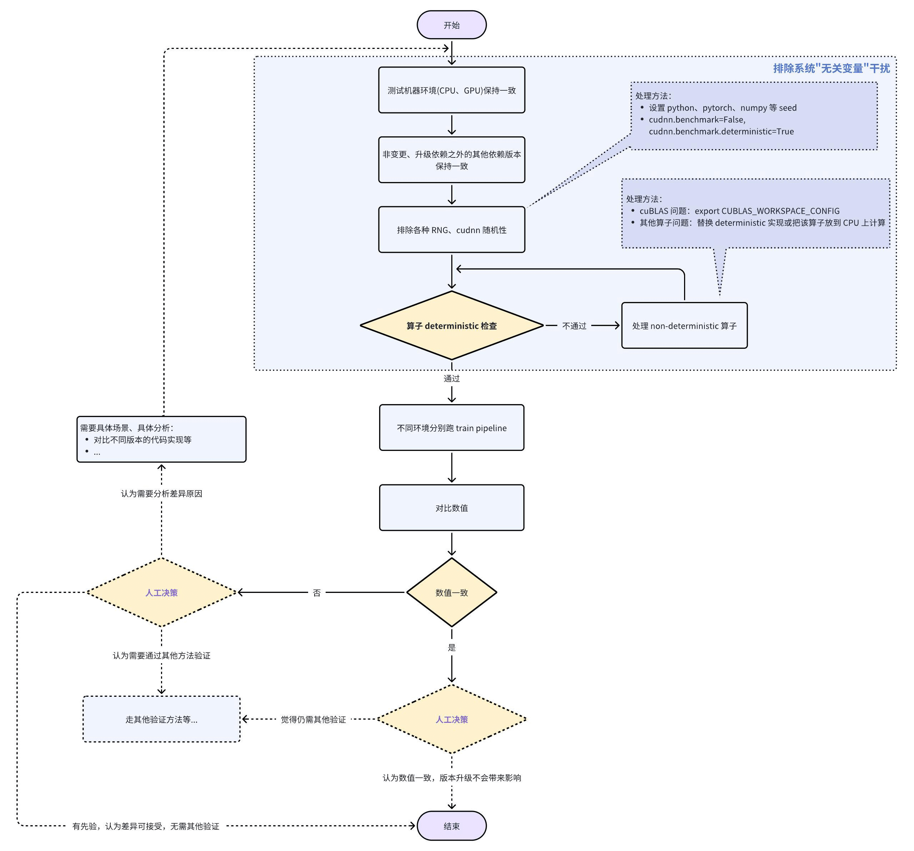

# 如何使用数值一致性检查工具

在环境、模型发生变化时（比如 torch 版本升级等），可以使用数值一致性检查工具来对 “变化是否会导致训练产生差异” 进行初步检查，帮助发现升级可能会带来的风险等。

## Pytorch 中有哪些随机因素

在我们进行数值一致性检查之前，先了解一下在 Pytorch 模型训练中常见的随机因素有哪些。详细内容可以查看 [Pytorch Reproducibility 文档](https://pytorch.org/docs/stable/notes/randomness.html)，主要包括以下部分：

> 注意：不同的硬件环境（比如 cpu、gpu）以及系统环境（OS）可能会产生数值不一致的问题，因此数值一致性验证需保证是在相同的硬件基础之上去做，本文档的内容陈述也是基于前后使用相同的硬件环境（cpu、gpu）以及系统环境（OS）为前提。

### 1. Random Number Generator

随机数是由随机数生成器(RNG, Random Number Generator) 来生成的，我们程序中用到的基本都是伪随机数生成器（Pseudo Random Number Generator），并非真正的随机，通常接受一个 seed 用来初始化生成器的初始状态，所以可以通过固定 seed 来保证伪随机数生成器产生相同的随机数。而不同的程序中 RNG 的算法可能不大一样，因此，需要多各个依赖库分别设置初始化 seed 参数。

Random Number Generator 带来的随机性主要在：

* Pytorch 随机性
* Python
* 其他库：主要为 numpy
* 多进程/多线程

这些 Random Number Generator 造成的随机性，可以通过设置 seed 解决，比如：

```python
# python
import random
random.seed(seed)
os.environ['PYTHONHASHSEED'] = str(seed)

# numpy
import numpy as np
np.random.seed(seed)

# pytorch
import torch
torch.manual_seed(seed)  # cpu 种子
torch.cuda.manual_seed(seed)  # 当前 GPU 的种子
torch.cuda.manual_seed_all(seed)    # 所有可用 gpu 的种子

# 多进程/多线程
def seed_worker(worker_id):
    worker_seed = torch.initial_seed() % 2**32
    numpy.random.seed(worker_seed)
    random.seed(worker_seed)

DataLoader(
    xxx,
    batch_size=batch_size,
    num_workers=num_workers,
    worker_init_fn=seed_worker,
)
```

### 2. Non-deterministic Algorithms

通过以上 seed 设置，可以确保 RNG 产生的随机数保持一致。但还不能保证模型训练中的数值达到一致，因为 CUDA 和 Pytorch 中的一些算子的计算就是 nondeterministic 的，无法保证数值的一致性，具体细节可见 [Pytorch 文档](https://pytorch.org/docs/stable/generated/torch.use_deterministic_algorithms.html)。

* CUDA 中的 nondeterministic 算子

当 `torch.backends.cudnn.benchmark` 选项为 `True` 时候， 为了提升训练效率，会自动试运行不同优化的卷积算法，以搜索最优最快的算法实现，由于不同硬件以及不同的版本的卷积算法实现，可能会导致训练结果不一致。所以，为了算法可复现，通常设置 `cudnn.benchmark = False`
此外，虽然禁用 `cudnn.benchmark `优化可以确保CUDA每次运行应用程序时选择相同的卷积算法，但其他算法本身可能是不确定的，如 `gather` 等操作，所以需要设置成固定的 `cudnn.deterministic = True`：

```python
torch.backends.cudnn.benchmark = False
torch.backends.cudnn.deterministic = True
```

* 在 CUDA 版本 >=10.2 时，部分 cuBLAS 中中算子的底层实现是 nondeterministic 的，需要设置环境变量:

```bash
export CUBLAS_WORKSPACE_CONFIG=:4096:8
# 或
export CUBLAS_WORKSPACE_CONFIG=:16:8
```
对应到 Pytorch 中的算子为: `torch.mm()`, `torch.mv()`, `torch.bmm()`.


* 其他算子：比如用户自定义算子、其他第三方包算子等，这部分暂时不能完全确定，需要遇到时再做针对处理。

## 数值一致性对比流程

在我们进行数值一致性验证时，变更的内容（环境、代码、版本等）是我们的 “控制变量”，上一章节中 Pytorch 一系列的随机因素可以归为“无关变量”（如果我们的变更内容不涉及到随机因素模块的话），那么我们在做一致性验证时就需要尽可能排除“无关变量”的影响。建议的数值一致性对比流程如下：



## HAT 中数值一致性对比

### 1. 检查 && 排除 “无关变量”

基于上述流程，我们在做数值一致性检查时，需要先设置 seed 排除 RNG 随机因素，并确认模型中是否有 non-deterministic 的 module 或 算子。需要在 config 中设置 `deterministic_level = 1` 或环境变量 `os.environ["HAT_DETERMINISTIC_LEVEL"]="1"`：

```python
# 固定 seed
seed = 1234

# 设置检查是否有 non-deterministic 的 module 或 算子
deterministic_level = 1  # deterministic_level=1 时，即会设置 torch.use_deterministic_algorithms(True)

# 或设置环境变量
# os.environ["HAT_DETERMINISTIC_LEVEL"] = "1"

```

 
上述设置后，torch 中 non-deterministic 算子会出现两种情况：
* 若该 算子 或 Module 默认是 non-deterministic，而 torch 中同时有 deterministic 版实现，则设置后，会使用 deterministic 版本；
* 若该 算子 或 Module 默认是 non-deterministic，而 torch 中又没有 deterministic 版实现，则会报出相应的 RuntimeError；

若上述设置后，训练中报出 deterministic 相关的 RuntimeError，则需要增加 hook 处理 non-deterministic 模块，以排除“无关变量”。在 config 中设置 `deterministic_level = 2`或环境变量 `os.environ["HAT_DETERMINISTIC_LEVEL"]="2"`:

```python
# 固定 seed
seed = 1234

# 设置检查是否有 non-deterministic 的 module 或 算子
deterministic_level = 2  # 设置 2 时，会在 deterministic_level=1的基础上，增加 hook，把 non-deterministic module 和 op 放到 cpu 上执行

# 或设置环境变量
# os.environ["HAT_DETERMINISTIC_LEVEL"] = "2"

```

Note:
`deterministic_level` 可以设置选项为 `0`、`1`、`2`，其中：
* `0`: 即默认值，什么也不会做；
* `1`: 会设置 `torch.use_deterministic_algorithms(True)`
* `2`: 会设置 `torch.use_deterministic_algorithms(True)`，并且为 torch、plugin 中的 non-deterministic 算子和 Module 增加 hook，将其放在 CPU 上执行；


### 2. dump 数据

数值一致性对比需要先对模型的输出等进行dump，HAT 里已有 `DumpData` callbacks 支持对模型的输入、输出、梯度进行 dump。使用方式如下(config 文件中配置):

```python

# 1. 务必设置 seed，避免 pytorch、numpy、cuda 等一些随机性
seed = 1234

# 2. 设置 deterministic_level，具体 1 或 2，可根据上一步中的检查情况来设置
deterministic_level = 2  # 或 1 

# 3. 设置 dump_data callback

def reformat_func(model_outs):
    # 对于模型的输出，DumpData callback 已经支持 Dict[str, torch.Tensor/str/numpy]，Tuple[torch.Tensor/str/numpy]，List[torch.Tensor/str/numpy] 这些格式；
    # 如果含有其他特殊格式，需要由用户自定义函数，将模型输出转化为上述格式（Dict/Tuple/List）
    ...
    new_model_outs = ...
    
    return new_model_outs

dump_callback = dict(
    type="DumpData",
    output_dir="./tmp_dump_data",           # 设置 dump 文件的保存路径
    dump_batch_data=True,                   # dump 模型输入，默认 True，如不需要dump，设置 False
    dump_model_outs=True,                   # dump 模型输出，默认 True，如不需要dump，设置 False
    dump_model_grad=True,                   # dump 参数梯度，默认 True，如不需要dump，设置 False
    name_prefix="test_dump_data",           # dump 文件名称，会保存成 test_dump_data.pkl
    reformat_model_outs_fn=reformat_func,   # 自定义模型输出的转化函数，可选，默认 None
)

# 4. 在 trainer 中使用 dump_data callback
xxx_trainer = dict(

    ...
    callbacks=[
        ...
        dump_callback,  # 增加 dump_data callback
        ...
    ],

)

```
之后启动训练即可，会在训练过程中生成相应的 dump 文件。


### 3. 数值一致性对比

HAT 在 `tools/analyze/compare_dump_data.py` 提供了检查dump文件数值差异的脚本，使用命令如下:

```bash
base_file=test_dump_data_base_data.pkl   # 标准数据的 dump 文件
cmp_file=test_dump_data_cmp_dat.pkl      # 需要对比的 dump 文件

output_dir=./tmp_diff_out_seed1234       # 对比结果的保存文件夹

python tools/analyze/compare_dump_data.py --base-file ${base_file} --cmp-file ${cmp_file} \
    --output-dir ${output_dir} \    # 保存文件夹
    --diff-inputs \                 # 对比模型输入
    --diff-outputs \                # 对比模型输出
    --diff-grad \                   # 对比模型梯度
    --file-name "diff_reports"      # diff_report 文件
```

执行上面命令后，会在指定的 `output_dir` 目录下生成 `diff_report.csv` 文件，该文件中各字段含义是：

```python
key             # 由 step、数据类型、模型参数名等拼接而成. (下面是指 key 的 value 对比)
all_same        # base_data 和 cmp_data 是否完全一致，True 或 False
max_base_data   # base_data 中的最大值
max_cmp_data    # cmp_data 中的最大值
min_base_data   # base_data 中的最小值
min_cmp_data    # cmp_data 中的最小值
max_diff        # base_data 和 cmp_data 差异数据的最大值
diff_elem_num   # base_data 和 cmp_data 差异数据的个数
diff_percent    # base_data 和 cmp_data 差异数据的个数占总数据个数的比例
check_result    # check 结果，"Pass" 或 "False" (all_same = True 为 "Pass", 否则 "False"), 对于某些对比失败的数据，会加上对比失败原因，即 Exception
```

注: 当前对比数值差异方法为 `(A - B) < np.finfo(np.float32).eps` 时，即为完全一致(`all_same=True`), 否则，则为不一致(`all_same=False`)


## FAQ：

### 1. 如何判断数值是否“一致”？

当前的`compare_dump_data`对比工具会对 `dump_data` 中相同 `key` 的 `value` 做 `element-wise` 的相减操作，默认会把元素数值差异小于 numpy float32 精度计算误差 ` np.finfo(np.float32).eps(=1.1920929e-07)` 时，即 `(A - B) < np.finfo(np.float32).eps` ，认为是 “一致” 的，否则就是“不一致”（可以结合生成 report 中 `all_same` 和 `max_diff` 这两列来判断）。当然，“误差” 在哪个数量级属于“合理”或“可接受”，用户也可以根据经验或主观判断自行设置，比如，认为 “误差” 小于 `1e-6` 或 `1e-5` 也属于 “合理，可接受”。


### 2. 一致性工具存储和对比了哪些数据？如何分析？

当前 HAT 中会依次保存训练中产生的四部分内容（包括 step 和 rank 信息），并将对比结果保存到 csv 文件中。
其中，保存信息为：
- batch-data：模型输入
- model parameter：模型参数
- model outputs：模型 forward 输出
- params grad：backward 后，参数的梯度

当产生不一致时，优先排查自己的代码变更。若自己代码无变更，可以参考使用如下分析流程，找出差异产生的大致范围：
1. 先检查模型输入 batch_data 是否一致：
  * 若一致，则继续下一步；
  * 若不一致，则检查 dataloader（数据读取、transforms 等）；
2. 检查模型参数是否一致；
  * 若一致，则继续下一步；
  * 若不一致，若是第一个 step，则检查模型参数初始化方法；若是第 N（N>1）个 step，则可能是 backward 或 optimizer：
    结合下面第 4 步，若梯度一致，但参数不一致，则有可能是 optimizer 有差异；若梯度就不一致，则优先查找梯度不一致原因；
3. 检查模型输出是否一致；
  * 若一致，则继续下一步；
  * 若不一致，检查 forward 中是否有模块导致不一致；
4. 检查梯度是否一致：
  * 若一致，则继续下一步；
  * 若不一致，检查是否有算子的 backward 导致了不一致；
