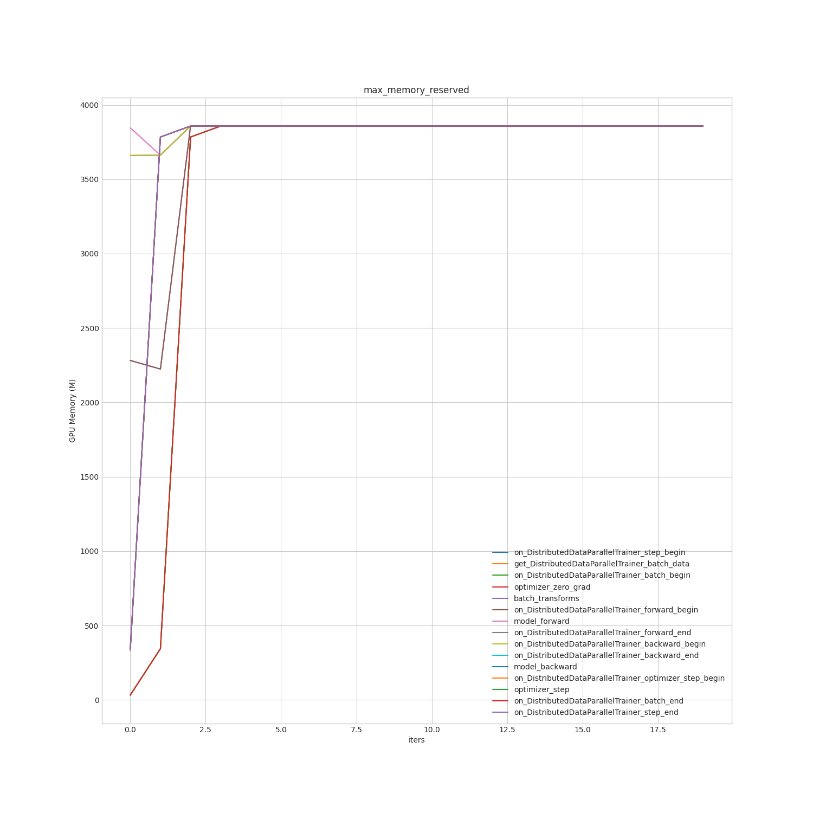

# 如何使用 GPU 显存占用分析工具

## 介绍

在进行模型训练的时候，有时会遇到一些奇怪的OOM（out of memory）问题，为了帮助用户快速的定位到模型训练过程中的显存瓶颈在哪个阶段，HAT提供了相应的 GPU 显存 Profiler 工具。本文档中主要介绍如何使用该工具来定位问题。

## 预备知识

在介绍 `GPUMemoryProfiler` 工具使用之前，我们先来了解一下 Pytorch 的显存分配原理，以便可以了解 Profiler 的工作原理，轻松读懂 Profiler 输出数据。

Pytorch拥有一套自己的显存管理系统，我们平时使用nvidia-smi命令显示出来的显存大小，并不能反应模型在训练过程中真正需要占用的显存，这里提供一个公式：

`nvidia-smi 里看到的占用 = CUDA 上下文 + pytorch 缓存区 =  CUDA 上下文 + 未使用缓存 + 已使用缓存`

其中，

* `CUDA上下文`：表示CUDA初始化时需要额外耗费一定的显存,其大小和具体的硬件、CUDA版本相关，属于不可避免的显存消耗；
* `已使用缓存`：表示真正被tensor占用的缓存，包括数据、特征图、梯度、模型参数等；
* `未使用缓存`: 表示未被tensor占用但是也没有被完全释放的区域；

Pytorch 本身也提供了丰富的显存管理接口，可以帮助我们查看未使用的缓存和已使用的缓存大小是多少。想要了解更多，可以直接查看 Pytorch 的官方文档：[Pytorch memory-management](https://pytorch.org/docs/stable/cuda.html#memory-management)

`GPUMemoryProfiler` 工具也是调用的Pytorch的接口，核心有下面几个：

* `torch.cuda.memory_allocated(device=None)` : 表示当前时刻真正被tensor占用的显存大小，也就是上面公式中的已使用缓存。
* `torch.cuda.max_memory_allocated(device=None)`: 表示从程序运行到当前时刻，真正被tensor占用的显存大小的最大值。
* `torch.cuda.memory_reserved(device=None)`: 表示当前时刻被缓存区占用的显存大小，它的值等于已使用的缓存和未使用但没有释放的缓存。
* `torch.cuda.max_memory_reserved(device=None)`: 表示从程序运行到当前时刻，被缓存区占用的显存大小的最大值。

对 Pytorch 显存管理和相应接口有了初步了解后，我们接下来就看如何使用 HAT 中的 `GPUMemoryProfiler` 来获取显存占用信息。

## 粗粒度：查看显存占用变化趋势

首先，我们可以利用 `GPUMemoryProfiler` 工具粗粒度查看显存占用多少，以及在训练过程中显存占用情况的变化趋势。只需在 config 中按如下设置即可：

```python
gpu_memory_profiler = dict(
    type="GPUMemoryProfiler",               # 指定 GPUMemoryProfiler
    dirpath="./tmp_gpu_memory_profiler",    # 不需要保存至文件时可不填
    filename='profile.log',                 # 设置 None 时仅 print，不保存到文件
)

float_trainer = dict(
    type="distributed_data_parallel_trainer",
    ......
    stop_by="step",
    num_steps=N,                            # 适当设置 num_steps 数目
    ......
    profiler=gpu_memory_profiler,           # 设置 trainer 的 profiler 为上述的 gpu_memory_profiler
)
```

之后，启动训练即可。在结束之后，可以看到在 `tmp_gpu_memory_profiler` 看到两种展示：

1. `profile.log ` 中包含类似如下信息：

```
TRAIN GPU Memory Profiler Report

Action                                                	|  memory_allocated (M)  	|  memory_reserved (M)   	|  max_memory_ allocated (M)	|  max_memory_reserved (M)	|  nvidia_smi (M)        	|  num_calls             	|  
---------------------------------------------------------------------------------------------------------------------------------------------------------------------------------------------------------------------------
set_device                                            	|  14.0390625            	|  32.0                  	|  14.0390625            	|  32.0                  	|  1624.75               	|  1                     	|  
on_DistributedDataParallelTrainer_loop_begin          	|  28.04052734375        	|  46.0                  	|  28.04052734375        	|  46.0                  	|  1652.75               	|  1                     	|  
on_DistributedDataParallelTrainer_epoch_begin         	|  28.04052734375        	|  46.0                  	|  28.041015625          	|  46.0                  	|  1652.75               	|  1                     	|  
on_DistributedDataParallelTrainer_step_begin          	|  54.372412109375       	|  3420.4                	|  54.372412109375       	|  3420.4                	|  6013.25               	|  20                    	|  
get_DistributedDataParallelTrainer_batch_data         	|  54.372412109375       	|  3420.4                	|  54.372412109375       	|  3420.4                	|  6013.25               	|  20                    	|  
on_DistributedDataParallelTrainer_batch_begin         	|  54.372412109375       	|  3420.4                	|  54.372412109375       	|  3420.4                	|  6013.25               	|  20                    	|  
optimizer_zero_grad                                   	|  41.2064697265625      	|  3420.4                	|  54.372412109375       	|  3420.4                	|  6013.25               	|  20                    	|  
batch_transforms                                      	|  115.2074462890625     	|  3637.3                	|  2206.9574462890623    	|  3637.3                	|  6247.65               	|  20                    	|  
on_DistributedDataParallelTrainer_forward_begin       	|  115.2074462890625     	|  3637.3                	|  115.2074462890625     	|  3637.3                	|  6247.65               	|  20                    	|  
model_forward                                         	|  3481.6080322265625    	|  3766.1                	|  3490.343798828125     	|  3775.4                	|  6407.25               	|  20                    	|  
on_DistributedDataParallelTrainer_forward_end         	|  3481.6080322265625    	|  3766.1                	|  3481.6080322265625    	|  3766.1                	|  6407.25               	|  20                    	|  
on_DistributedDataParallelTrainer_backward_begin      	|  3481.6090087890625    	|  3766.1                	|  3481.6090087890625    	|  3766.1                	|  6407.25               	|  20                    	|  
on_DistributedDataParallelTrainer_backward_end        	|  129.5560791015625     	|  3606.4                	|  129.5560791015625     	|  3606.4                	|  6251.15               	|  20                    	|  
model_backward                                        	|  129.5560791015625     	|  3606.4                	|  129.5560791015625     	|  3606.4                	|  6251.15               	|  20                    	|  
on_DistributedDataParallelTrainer_optimizer_step_begin	|  129.5560791015625     	|  3606.4                	|  129.5560791015625     	|  3606.4                	|  6251.15               	|  20                    	|  
optimizer_step                                        	|  130.2490234375        	|  3607.0                	|  134.14833984375       	|  3607.0                	|  6251.75               	|  20                    	|  
on_DistributedDataParallelTrainer_batch_end           	|  130.2490234375        	|  3607.0                	|  130.25244140625       	|  3607.0                	|  6251.75               	|  20                    	|  
on_DistributedDataParallelTrainer_step_end            	|  55.75830078125        	|  3607.0                	|  55.75830078125        	|  3607.0                	|  6251.75               	|  20                    	|  
on_DistributedDataParallelTrainer_epoch_end           	|  55.75830078125        	|  3778.0                	|  55.7626953125         	|  3778.0                	|  6422.75               	|  1                     	|  
on_DistributedDataParallelTrainer_loop_end            	|  55.75830078125        	|  3778.0                	|  55.75830078125        	|  3778.0                	|  6422.75               	|  1                     	|  
---------------------------------------------------------------------------------------------------------------------------------------------------------------------------------------------------------------------------
memory_allocated: Returns the current GPU memory occupied by tensors in bytes for a given device.
memory_reserved: Returns the current GPU memory managed by the caching allocator in bytes for a given device.
max_memory_allocated: Returns the maximum GPU memory occupied by tensors in bytes for a given device.
max_memory_reserved: Returns the maximum GPU memory managed by the caching allocator in bytes for a given device.
Reference: https://pytorch.org/docs/stable/cuda.html#memory-management

```

2. 图片展示显存占用趋势, 例如:




## 细粒度：细化显存占用到具体代码

上述粗粒度展示中，仅能查看显存占用情况及变化趋势，无法对应到具体某个位置（代码行，Tensor 显存地址等）。从 torch 1.13.0 开始，Pytorch 加入了 GPU Memory Snapshot 功能，可以把显存占用追溯到具体的代码行，可以参照该博客：[Debugging PyTorch memory use with snapshots](https://zdevito.github.io/2022/08/16/memory-snapshots.html)。HAT 中的 `GPUMemoryProfiler` 也已集成了该工具，若要使用，进行如下配置即可：

```python
gpu_memory_profiler = dict(
    type="GPUMemoryProfiler",
    dirpath="./gpu_memory_profiler_results",  # 设置 profile 结果保存路径
    record_snapshot=True,                     # 设置 True，表示启用 snapshot 功能
    snapshot_interval=1,                      # snapshot 保存间隔，与训练 step 同步
    record_functions=None,                    # 要记录的 profiler 埋点阶段
)

float_trainer = dict(
    type="distributed_data_parallel_trainer",
    ...
    profiler=gpu_memory_profiler,
)
```

主要参数：
* `record_snapshot`：是否启用 snapshot 功能，True 表示启用；
* `snapshot_interval`：snapshot 保存间隔，与 step 同步（间隔过小的话可能会产生较多/较大文件，使用时可根据实际情况适当设置）
* `record_functions`：要保存 sanpshot 的埋点阶段，默认（设置 None 时）会在下面这些阶段分别保存 snapshot：
```
DEFAULT_RECORD_FUNCS = {
    "optimizer_zero_grad",
    "batch_transforms",
    "model_forward",
    "model_backward",
    "optimizer_step",
}
```

### 产物及分析工具

介绍分析工具之前，先了解下 MemorySnapshot 的工作流程及产物：
1. 工作流程：
* 该 Profiler 会在每个埋点位置（DEFAULT_RECORD_FUNCS）结束时，立即保存截至该埋点位置的 snapshot；
* 并将 snapshot 其转化为可被 FrameGraph 火焰图可视化读取的格式（文件后缀 `snapshot-xxx.txt`）；
* 会尝试(`try...catch...`)将 `snapshot-xxx.txt` 文件转化为可直接在浏览器可视化的 SVG 文件（但可能因网络原因失败）；
* 将 Profile 过程中所有的 snapshot 信息汇总保存到 `snapshot-xxx.json` 文件；

2. 产物：
* 上述提到的 `snapshot-xxx.txt` 、`snapshot-xxx.json` 以及可能存在的 `snapshot-xxx.svg`

下面介绍三种工具对 snapshot 产物进行可视化分析的工具:

**工具一： framegraph.fl**

优点：
- 色彩对比度高，很容易一眼看出模块间显存占用的差异

缺点：
- 网络原因，很大可能会失败，需要手动下载和转化

该工具是 pytorch memory_vis 中默认使用的(转 svg)可视化工具，HAT 中也已默认支持该功能。但由于需要先下载 Github 上 FlameGraph 中的 flamegraph.pl 文件，由于网络原因(比如公司开发机无法访问 github)，HAT中自动转化 svg 的这一过程可能会失败，此时，则需要用户手动下载 flamegraph.pl  文件，并利用该文件将 snapshot 手动转化为 svg 文件：
1. 下载 flamegraph.pl && 授予权限

```bash

wget -c https://raw.githubusercontent.com/brendangregg/FlameGraph/master/flamegraph.pl

chmod +x flamegraph.pl

```

2. 把 snapshot-xxx.txt  转化为 svg
```bash
./flamegraph.pl snapshot-xxx.txt > snapshot-xxx.svg
```
然后把 `snapshot-xxx.svg` 拖入浏览器即可显示.


**工具二：https://flamegraph.com/  (推荐)**

优点：
* 无需手动转化，直接上传 `snapshot-xxx.txt` 文件即可；
* **支持对比(diff) 功能**；

该工具的使用，只需访问网页，并将 snapshot-xxx.txt 上传至该网站即可.


注：各工具的详细使用可参照飞书文档：[GPU MemorySnapshot 分析工具](https://horizonrobotics.feishu.cn/wiki/HOwPwwWndi8T5zkhGHNcdCFUn3b)