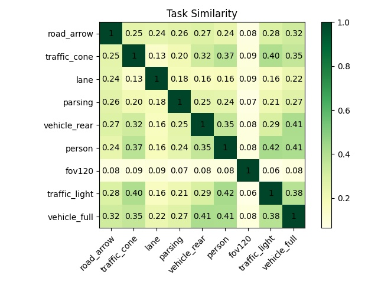

# 如何使用任务相似度分析工具

## 介绍

多任务学习中相似任务分组训练是避免 negative transfer 的重点，用户可以通过使用本工具评估任务在 backbone、neck 或 head 上的稀疏结构相似度，指导任务分组训练和辅助任务训练。

受到 ResRep([ResRep: Lossless CNN Pruning via Decoupling Remembering and Forgetting](https://arxiv.org/pdf/2007.03260.pdf)) 模型剪枝算法的启发，使用该算法的剪枝过程获取 backbone 上的稀疏结构。通过在每个ConvModule2d 后添加 compactor 模块来获得整个 backbone、neck 或 head 上的稀疏结构。以被剪枝的 filters 集合的交并比作为两两任务的相似度，最终获得所有任务之间的相似度矩阵。

## 使用步骤

按照如下流程进行配置和相似度评估：
### 1. 在 config 文件中指定预训练模型
```python
# HAT/projects/fsd/app/configs/mt-6v.py
float_checkpoint_path = model_zoo["t20220328_6v"]["float_checkpoint"]
float_resume_checkpoint = float_checkpoint_path
```
### 2. 配置 callback
本工具只支持基于 float 阶段进行相似度评估，需要取消其他阶段的训练。callback 配置如下：before_mask_iters 为经过多少 steps 之后开始执行 mask 操作，mask 初始状态为1；mask_interval 为每隔多少 steps 更新 mask 的值，算法会根据 mask 的值来进行 compactor 模块的参数的 gradients 魔改运算，mask 值为 0 的 channels 的权重会更趋近于0，mask_interval 越大，训练后被剪枝掉的 filters 越少；pruned_epsilone 为筛选被剪枝 filters 的阈值，该值越大，被剪枝 filters 越少；name 为需要获取稀疏结构的模块名。
```
compactor_update_callback = dict(
    type="CompactorUpdater",
    before_mask_iters=200,
    mask_interval=200,
    pruned_epsilon=1e-5,
    modules=["backbone", "bifpn_neck"],
)
```
### 3. 指定任务
指定想要获取稀疏结构的任务，以 vehicle rear 单任务为例：
```python
# HAT/projects/fsd/app/configs/mt-6v.py
_2D_CONFIGS = [
    os.path.join(cfg_dir, 'auto_2d_v2/vehicle_rear.py'),
]
CONFIGS = _2D_CONFIGS
```
### 4. 训练
训练结束后，可以在 log 中的 float 阶段的最后看到下列格式的输出：
```shell
...
pruned ids:  [1, 2, 7, 8, 10, 15, 18, 19, 26]
pruned ids:  [24, 32, 33, 47]
pruned ids:  [4, 5, 8, 9, 21, 24, 26, 32, 44, 46]
...
  ```
### 5. 获得任务相似度矩阵
获取到多个单任务的稀疏结构后，可以使用相似度分析脚本输出相似度矩阵，脚本会根据给出的 log 中的 pruned ids 进行统计，任务的被剪枝 filters 数据分布柱状图和两两任务间的相似度矩阵。

注：使用中需要给出多个任务的 log 进行联合分析，不能仅给出一个任务！

```shell
python tools/analyze/task_similarity.py --cfg task_similarity.yaml
```

输入需要指定 config，按照如下格式进行配置, raw_log 中的 key 为任务名，value 对 log 的 url，base_saved_path 为脚本输出的 log、被剪枝 filters 数目柱状图和任务相似度矩阵的保存路径，log、num_distribution 和 task_similarity 为对应的文件名：
```yaml
raw_log:
  vehicle full: http://fm-junyu-zhang.train.hogpu.cc/plat_gpu/fsd_multitask_6v_auto_2d_v2_vehicle_full_compactor-20220304-103056/log/hobot-job-1358084-task-0.log
  traffic light: http://fm-junyu-zhang.train.hogpu.cc/plat_gpu/fsd_multitask_6v_auto_2d_v2_traffic_light_compactor-20220304-103319/log/hobot-job-1358105-task-0.log
  road_arrow: http://fm-junyu-zhang.train.hogpu.cc/plat_gpu/fsd_multitask_6v_auto_2d_v2_road_arrow_compactor-20220224-172546/log/hobot-job-1330096-task-0.log
  parsing: http://fm-junyu-zhang.train.hogpu.cc/plat_gpu/fsd_multitask_6v_auto_2d_v2_parsing_compactor-20220211-142925/log/hobot-job-1281734-task-0.log
  traffic cone: http://fm-junyu-zhang.train.hogpu.cc/plat_gpu/fsd_multitask_6v_auto_2d_v2_traffic_cone_compactor-20220224-172746/log/hobot-job-1330108-task-0.log
  lane: http://fm-junyu-zhang.train.hogpu.cc/plat_gpu/fsd_multitask_6v_auto_2d_v2_lane_compactor-20220224-172833/log/hobot-job-1330111-task-0.log
  person: http://fm-junyu-zhang.train.hogpu.cc/plat_gpu/fsd_multitask_6v_auto_2d_v2_person_compactor-20220224-172016/log/hobot-job-1330089-task-0.log
base_saved_path: tmp_output
log: display_pruned_ids.log
num_distribution: num_distribution.png
task_similarity: task_similarity.png
```

在脚本输出日志的最后和 task_similarity.png 中可以看到任务相似度矩阵，形式如下，数值越高，相似度越大。可以看到 fov120 作为 3d 任务和其他 2d 任务间相似度都非常低，vehicle rear 和 vehicle full 相似度很高，traffic light、traffic cone 和 person 相似度很高。在任务分组训练时可以尝试相似度较高的任务搭配训练。
```shell
2022-03-07T11:06:24.760241+0800 INFO ========== the matrix of all task pairs ===========
2022-03-07T11:06:24.806863+0800 INFO 
              road_arrow  traffic_cone      lane   parsing  ...    person    fov120  traffic_light  vehicle_full
road_arrow       1.000000      0.251272  0.243475  0.263527  ...  0.241018  0.080131       0.289785      0.326480
traffic_cone     0.251272      1.000000  0.135189  0.204569  ...  0.377884  0.092964       0.405546      0.353283
lane             0.243475      0.135189  1.000000  0.186097  ...  0.169974  0.095173       0.162383      0.227196
parsing          0.263527      0.204569  0.186097  1.000000  ...  0.243968  0.070835       0.214984      0.274897
vehicle_rear     0.277507      0.326573  0.163592  0.250353  ...  0.353248  0.085045       0.294800      0.416335
person           0.241018      0.377884  0.169974  0.243968  ...  1.000000  0.084589       0.425200      0.413751
fov120           0.080131      0.092964  0.095173  0.070835  ...  0.084589  1.000000       0.063821      0.089260
traffic_light    0.289785      0.405546  0.162383  0.214984  ...  0.425200  0.063821       1.000000      0.386830
vehicle_full     0.326480      0.353283  0.227196  0.274897  ...  0.413751  0.089260       0.386830      1.000000
```
png 如下：


## 其他
更多 ResRep 算法和本工具开发过程可查看下列文档：
- [Survey and Our Method：Neural Architecture Search in Multi-Task Learning](https://horizonrobotics.feishu.cn/docs/doccnUb0vA6kpNniRMlvYdnpWuf)
- [ResRep: Lossless CNN Pruning via Decoupling Remembering and Forgetting](https://arxiv.org/pdf/2007.03260.pdf)