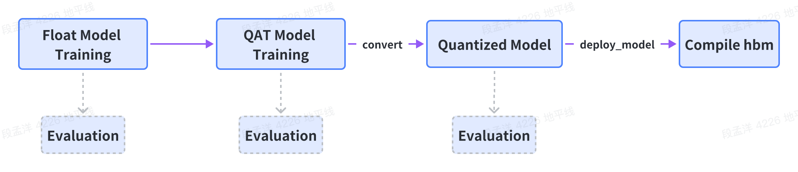

PointPillars检测模型训练
=====================

这篇教程主要是告诉大家如何利用 `HAT` 在雷达点云数据集 `KITTI-3DObject` 上从头开始训练一个\
`PointPillars` 模型，包括浮点、量化和定点模型。

数据集准备
-------------
在开始训练模型之前，第一步是需要准备好数据集，我们在KITTI官网下载 `3DObject据集 <http://www.cvlibs.net/datasets/kitti/eval_object.php?obj_benchmark=3d>` ，
包括4个文件: 
    * 1. `left color images of object data set`, 
    * 2.  `velodyne point clouds`, 
    * 3. `camera calibration matrices of object data set`, 
    * 4. `taining labels of object data set` ，

下载上述4个文件后，解压并按照如下方式组织文件夹结构：

  .. code-block:: bash

    ├── tmp_data
    │   ├── kitti3d
    │   │   ├── testing
    │   │   │   ├── calib
    │   │   │   ├── image_2
    │   │   │   ├── velodyne
    │   │   ├── training
    │   │   │   ├── calib
    │   │   │   ├── image_2
    │   │   │   ├── label_2
    │   │   │   ├── velodyne

为了创建 KITTI 点云数据，首先需要加载原始的点云数据并生成相关的包含目标标签和标注框的数据标注文件，\
同时还需要为 KITTI 数据集生成每个单独的训练目标的点云数据，并将其存储在 `data/kitti/gt_database` 的 `.bin`` 格式的文件中，\
此外，需要为训练数据或者验证数据生成 .pkl 格式的包含数据信息的文件。随后，通过运行下面的命令来创建 KITTI 数据:
 
  .. code-block:: bash

    mkdir ./tmp_data/kitti3d/ImageSets
    # 从社区下载数据集划分文件
    wget -c  https://raw.githubusercontent.com/traveller59/second.pytorch/master/second/data/ImageSets/test.txt --no-check-certificate --content-disposition -O ./tmp_data/kitti3d/ImageSets/test.txt
    wget -c  https://raw.githubusercontent.com/traveller59/second.pytorch/master/second/data/ImageSets/train.txt --no-check-certificate --content-disposition -O ./tmp_data/kitti3d/ImageSets/train.txt
    wget -c  https://raw.githubusercontent.com/traveller59/second.pytorch/master/second/data/ImageSets/val.txt --no-check-certificate --content-disposition -O ./tmp_data/kitti3d/ImageSets/val.txt
    wget -c  https://raw.githubusercontent.com/traveller59/second.pytorch/master/second/data/ImageSets/trainval.txt --no-check-certificate --content-disposition -O ./tmp_data/kitti3d/ImageSets/trainval.txt
    python3 tools/create_data.py --dataset "kitti3d" --root-dir "./tmp_data/kitti3d"

执行上述命令后，生成的文件目录如下：

  .. code-block:: bash

    ├── tmp_data
    │   ├──── kitti3d
    │   │   ├── ImageSets
    │   │   │   ├── test.txt
    │   │   │   ├── train.txt
    │   │   │   ├── trainval.txt
    │   │   │   ├── val.txt
    │   │   ├── testing
    │   │   │   ├── calib
    │   │   │   ├── image_2
    │   │   │   ├── velodyne
    │   │   │   ├── velodyne_reduced        # 新生成的 velodyne_reduced
    │   │   ├── training
    │   │   │   ├── calib
    │   │   │   ├── image_2
    │   │   │   ├── label_2
    │   │   │   ├── velodyne
    │   │   │   ├── velodyne_reduced        # 新生成的 velodyne_reduced
    │   │   ├── kitti3d_gt_database           # 新生成的 kitti_gt_database
    │   │   │   ├── xxxxx.bin
    │   │   ├── kitti3d_infos_train.pkl       # 新生成的 kitti_infos_train.pkl
    │   │   ├── kitti3d_infos_val.pkl         # 新生成的 kitti_infos_val.pkl
    │   │   ├── kitti3d_dbinfos_train.pkl     # 新生成的 kitti_dbinfos_train.pkl
    │   │   ├── kitti3d_infos_test.pkl        # 新生成的 kitti_infos_test.pkl
    │   │   ├── kitti3d_infos_trainval.pkl    # 新生成的 kitti_infos_trainval.pkl

同时，为了提升训练的速度，我们对数据信息文件做了一个打包，将其转换成lmdb格式的数据集。只需要运行下面的脚本，就可以成功\
实现转换：

  .. code-block:: python

    python3 tools/datasets/kitti3d_packer.py --src-data-dir ./tmp_data/kitti3d/ --target-data-dir ./tmp_data/kitti3d --split-name train --pack-type lmdb
    python3 tools/datasets/kitti3d_packer.py --src-data-dir ./tmp_data/kitti3d/ --target-data-dir ./tmp_data/kitti3d --split-name val --pack-type lmdb

上面这两条命令分别对应着转换训练数据集和验证数据集，打包完成之后，data目录下的文件结构应该如下所示：

  .. code-block:: bash

    ├── tmp_data
    │   ├──── kitti3d
    │   │   ├── pack_data       # 新生成的 lmdb
    │   │   │   ├── train
    │   │   │   ├── val
    │   │   ├── ImageSets
    │   │   │   ├── test.txt
    │   │   │   ├── train.txt
    │   │   │   ├── trainval.txt
    │   │   │   ├── val.txt
    │   │   ├── testing
    │   │   │   ├── calib
    │   │   │   ├── image_2
    │   │   │   ├── velodyne
    │   │   │   ├── velodyne_reduced
    │   │   ├── training
    │   │   │   ├── calib
    │   │   │   ├── image_2
    │   │   │   ├── label_2
    │   │   │   ├── velodyne
    │   │   │   ├── velodyne_reduced
    │   │   ├── kitti3d_gt_database
    │   │   │   ├── xxxxx.bin
    │   │   ├── kitti3d_infos_train.pkl
    │   │   ├── kitti3d_infos_val.pkl
    │   │   ├── kitti3d_dbinfos_train.pkl
    │   │   ├── kitti3d_infos_test.pkl
    │   │   ├── kitti3d_infos_trainval.pkl

`train_lmdb` 和 `val_lmdb` 就是打包之后的训练数据集和验证数据集，也是网络最终读取的数据集，
 `kitti3d_gt_database` 和 `kitti3d_dbinfos_train.pkl` 是训练是用于采样的样本。

浮点模型训练
-------------
数据集准备好之后，就可以开始模型训练相关的内容。

模型构建
>>>>>>>>>

PointPillars 的网络结构可以参考
`论文 <https://openaccess.thecvf.com/content_CVPR_2019/papers/Lang_PointPillars_Fast_Encoders_for_Object_Detection_From_Point_Clouds_CVPR_2019_paper.pdf>`_ ，这里\
不做详细介绍。

从模型训练到编译上板的整个流程大致如下：

从上图中，主要用到了三个阶段的模型，即 `Float Model`、 `QAT Model`、 `Quantized Model`。其中，

* `Float Model`: 即是一般的浮点模型

* `QAT Model`: 即是插入伪量化结点的模型

* `Quantized Model`: 即量化后的模型，参数为 INT8 类型

此外，在训练、 编译等流程中又分别会使用不同结构或状态的模型：

* `model`: 完整的模型结构，即包含模型 `前处理`、 `网络结构`、 `后处理`，主要用于训练、评测。

* `deploy_model`: 只包含 `网络结构` （可以编译到 `hbm` 中的部分），不包含  `前处理` 和 `后处理`，主要用于编译。

我们通过定义一个 `PointPillarsModel` 类来与模型结构相关的所有内容，包含上述三个阶段： `Float Model`、 `QAT Model`、 `Quantized Model` 以及两种状态: `model` 和 `deploy_model`：

  .. code-block:: python

    class PointPillarsModel:

        task_name = "pointpillars_kitti_car" # 任务名（任意）
        march = horizon.march.March.BAYES  # 模型芯片架构

        @classmethod
        def model(cls):
            """模型结构"""
            model = cls._build_pp_model(cls, is_deploy=False)
            return model

        @classmethod
        def deploy_model(cls):
             """deploy model, 用于编译"""
            deploy_model = cls._build_pp_model(cls, is_deploy=True)
            return deploy_model

        @classmethod
        def deploy_inputs(cls):
            """deploy inputs, 用于编译"""
            deploy_inputs = dict(  # noqa C408
                points=[
                    torch.randn(150000, 4),
                ],
            )
            return deploy_inputs

        @classmethod
        def float_model(cls, pretrain_ckpt=None):
            """浮点模型"""
            model = cls.model()
            if pretrain_ckpt: # 加载参数
                ckpt_loader = LoadCheckpoint(
                    pretrain_ckpt,
                    allow_miss=False,
                    ignore_extra=False,
                    verbose=True,
                )
                model = ckpt_loader(model)

            return model

        @classmethod
        def qat_model(cls, pre_step_ckpt=None, pretrain_ckpt=None):
            """QAT 模型"""
            float_model = cls.float_model(pre_step_ckpt)
            qat_model = Float2QAT()(float_model)

            if pretrain_ckpt:  # 加载 QAT 参数
                ckpt_loader = LoadCheckpoint(
                    pretrain_ckpt,
                    allow_miss=False,
                    ignore_extra=False,
                    verbose=True,
                )
                qat_model = ckpt_loader(qat_model)

            return qat_model

        @classmethod
        def int_infer_model(cls, pre_step_ckpt=None, pretrain_ckpt=None, use_deploy=False):
            """ Quantized 模型"""
            if use_deploy:  # 用于编译
                model = cls.deploy_model()
            else:
                model = cls.model()  # 用于训练、评测
            
            model = Float2QAT()(model)  # float -> qat model

            if pre_step_ckpt:  # load QAT checkpoint
                qat_ckpt_loader = LoadCheckpoint(
                    pre_step_ckpt,
                    allow_miss=False,
                    ignore_extra=False,
                    verbose=True,
                )
                model = qat_ckpt_loader(model)  # qat model with state_dict

            int_model = QAT2Quantize()(model)   # qat -> quantized

            if pretrain_ckpt:
                int_ckpt_loader = LoadCheckpoint(
                    pretrain_ckpt,
                    allow_miss=False,
                    ignore_extra=False,
                    verbose=True,
                )
                int_model = int_ckpt_loader(model)

            return int_model

        def _build_pp_model(self, is_deploy=False):
            """模型结构具体实现"""
            def get_feature_map_size(point_cloud_range, voxel_size):
                point_cloud_range = np.array(point_cloud_range, dtype=np.float32)
                voxel_size = np.array(voxel_size, dtype=np.float32)
                grid_size = (point_cloud_range[3:] - point_cloud_range[:3]) / voxel_size
                grid_size = np.round(grid_size).astype(np.int64)
                return grid_size

            # Voxelization cfg
            pc_range = [0, -39.68, -3, 69.12, 39.68, 1]
            voxel_size = [0.16, 0.16, 4.0]
            max_points_in_voxel = 100
            max_voxels_num = 12000
            class_names = ["Car"]

            model = PointPillarsDetector(
                feature_map_shape=get_feature_map_size(pc_range, voxel_size),
                is_deploy=is_deploy,
                pre_process=PointPillarsPreProcess(
                    pc_range=pc_range,
                    voxel_size=voxel_size,
                    max_voxels_num=max_voxels_num,
                    max_points_in_voxel=max_points_in_voxel,
                ),
                reader=PillarFeatureNet(
                    num_input_features=4,
                    num_filters=(64,),
                    with_distance=False,
                    pool_size=(1, max_points_in_voxel),
                    voxel_size=voxel_size,
                    pc_range=pc_range,
                    bn_kwargs=None,
                    quantize=True,
                    use_4dim=True,
                    use_conv=True,
                ),
                backbone=PointPillarScatter(
                    num_input_features=64,
                    use_horizon_pillar_scatter=True,
                    quantize=True,
                ),
                neck=SequentialBottleNeck(
                    layer_nums=[3, 5, 5],
                    ds_layer_strides=[2, 2, 2],
                    ds_num_filters=[64, 128, 256],
                    us_layer_strides=[1, 2, 4],
                    us_num_filters=[128, 128, 128],
                    num_input_features=64,
                    bn_kwargs=None,
                    use_tconv=True,
                    use_secnet=True,
                    quantize=True,
                ),
                head=PointPillarsHead(
                    num_classes=len(class_names),
                    in_channels=sum([128, 128, 128]),
                    use_direction_classifier=True,
                ),
                anchor_generator=Anchor3DGeneratorStride(
                    anchor_sizes=[[1.6, 3.9, 1.56]],  # noqa B006
                    anchor_strides=[[0.32, 0.32, 0.0]],  # noqa B006
                    anchor_offsets=[[0.16, -39.52, -1.78]],  # noqa B006
                    rotations=[[0, 1.57]],  # noqa B006
                    class_names=class_names,
                    match_thresholds=[0.6],
                    unmatch_thresholds=[0.45],
                ),
                targets=LidarTargetAssigner(
                    box_coder=GroundBox3dCoder(n_dim=7),
                    class_names=class_names,
                    positive_fraction=-1,
                ),
                loss=PointPillarsLoss(
                    num_classes=len(class_names),
                    loss_cls=FocalLossV2(
                        alpha=0.25,
                        gamma=2.0,
                        from_logits=False,
                        reduction="none",
                        loss_weight=1.0,
                    ),
                    loss_bbox=SmoothL1Loss(
                        beta=1 / 9.0,
                        reduction="none",
                        loss_weight=2.0,
                    ),
                    loss_dir=CrossEntropyLoss(
                        use_sigmoid=False,
                        reduction="none",
                        loss_weight=0.2,
                    ),
                ),
                postprocess=PointPillarsPostProcess(
                    num_classes=len(class_names),
                    box_coder=GroundBox3dCoder(n_dim=7),
                    use_direction_classifier=True,
                    num_direction_bins=2,
                    # test_cfg
                    use_rotate_nms=False,
                    nms_pre_max_size=1000,
                    nms_post_max_size=300,
                    nms_iou_threshold=0.5,
                    score_threshold=0.4,
                    post_center_limit_range=[0, -39.68, -5, 69.12, 39.68, 5],
                    max_per_img=100,
                ),
            )

            if is_deploy:
                model.anchor_generator = None
                model.targets = None
                model.loss = None
                model.postprocess = None

            return model

        @classmethod
        def train_metrics(cls):
            """训练时打印 Log，只显示 loss 即可"""
            return LossShow()

        @classmethod
        def val_metrics(cls):
            """模型评测的 Metric"""
            class_names = ["Car"]
            val_metrics = Kitti3DMetricDet(
                compute_aos=True,
                current_classes=class_names,
                difficultys=[0, 1, 2],
            )
            return val_metrics

至此， `PointPillarsModel` 中已定义了与模型相关的所有内容，在使用时可以很方便的通过 `PointPillarsModel.xxx()` 获取相应的模型结构。

在完成网络结构的定义之后，我们可以使用以下命令先测试一下网络的计算量和参数数量：

  .. code-block:: python

    python3 examples/pointpillars_no_hat_trainer.py --calops

数据增强
>>>>>>>>>

类似 `模型构建` 部分，我们通过定义一个 `DataHelper` 来实现数据相关内容，包括 `transforms` ， `data_loader` 等：

  .. code-block:: python

    class DataHelper:

        data_dir = "./tmp_data/kitti3d"     # 数据根目录
        train_batch_size = 2                # 训练 batch_size
        val_batch_size = 1                  # 评测 batch_size

        @classmethod
        def train_data_loader(cls):
            """train dataloader 用于训练"""
            return cls.build_dataloader(cls, is_training=True)

        @classmethod
        def val_data_loader(cls):
            """val dataloader 用于评测验证"""
            return cls.build_dataloader(cls, is_training=False)

        def build_dataloader(self, is_training=True):
            """构建 dataloader 的具体实现"""
            transforms = self.build_transforms(self, self.data_dir, is_training)

            split_dir = "train_lmdb" if is_training else "val_lmdb"
            dataset = Kitti3D(
                data_path=os.path.join(self.data_dir, split_dir),
                transforms=transforms,
            )

            if is_training:
                sampler = torch.utils.data.DistributedSampler(dataset)
            else:
                sampler = None

            dataloader = torch.utils.data.DataLoader(
                dataset=dataset,
                batch_size=self.train_batch_size if is_training else self.val_batch_size,
                sampler=sampler,
                shuffle=False,
                num_workers=1,
                pin_memory=True,
                collate_fn=collate_kitti3d,
            )

            return dataloader

        def build_transforms(self, data_dir, is_training=True):
            """transforms 实现"""
            class_names = ["Car"]
            pc_range = [0, -39.68, -3, 69.12, 39.68, 1]

            if is_training:
                transforms = torchvision.transforms.Compose(
                    [
                        ObjectSample(
                            class_names=class_names,
                            remove_points_after_sample=False,
                            db_sampler=DataBaseSampler(
                                enable=True,
                                root_path="./tmp_data/kitti3d/",
                                db_info_path="./tmp_data/kitti3d/kitti3d_dbinfos_train.pkl",
                                sample_groups=[dict(Car=15)],
                                db_prep_steps=[
                                    dict(
                                        type="DBFilterByDifficulty",
                                        filter_by_difficulty=[-1],
                                    ),
                                    dict(
                                        type="DBFilterByMinNumPoint",
                                        filter_by_min_num_points=dict(
                                            Car=5,
                                        ),
                                    ),
                                ],
                                global_random_rotation_range_per_object=[0, 0],
                                rate=1.0,
                            ),
                        ),
                        ObjectNoise(
                            gt_rotation_noise=[-0.15707963267, 0.15707963267],
                            gt_loc_noise_std=[0.25, 0.25, 0.25],
                            global_random_rot_range=[0, 0],
                            num_try=100,
                            class_names=class_names,
                        ),
                        PointRandomFlip(probability=0.5),
                        PointGlobalRotation(rotation=[-0.78539816, 0.78539816]),
                        PointGlobalScaling(min_scale=0.95, max_scale=1.05),
                        ShufflePoints(True),
                        ObjectRangeFilter(point_cloud_range=pc_range),
                        LidarReformat(),
                    ]
                )
            else:
                transforms = torchvision.transforms.Compose([LidarReformat()])
            return transforms

训练策略
>>>>>>>>

为了训练一个精度高的模型，好的训练策略是必不可少的。对于每一个训练任务而言，不同阶段的模型(浮点、QAT) 其训练策略也会略有不同，因此，我们也把训练策略内容( `optimizer`, `lr_schedule`) 等也定义在 `PointPillarsModel` 里面:

  .. code-block:: python

    class PointPillarsModel:
        ...

        @classmethod
        def optimizer(cls, model, stage):
            """训练时用到的 optimizer 设置"""
            if stage == "float":
                return torch.optim.AdamW(
                    params=model.parameters(),
                    betas=(0.95, 0.99),
                    lr=2e-4,
                    weight_decay=0.01,
                )
            elif stage == "qat":
                return torch.optim.SGD(
                    params=model.parameters(),
                    lr=2e-4,
                    momentum=0.9,
                    weight_decay=0.0,
                )

            return None

        @classmethod
        def lr_schedule(cls, stage):
            """训练时用到的学习率调整策略"""
            if stage == "float":
                return CyclicLrUpdater(
                    target_ratio=(10, 1e-4),
                    cyclic_times=1,
                    step_ratio_up=0.4,
                    step_log_interval=50,
                )

            elif stage == "qat":
                return CyclicLrUpdater(
                    target_ratio=(10, 1e-4),
                    cyclic_times=1,
                    step_ratio_up=0.4,
                    step_log_interval=50,
                )

            return None

        @classmethod
        def val_metrics(cls):
            """模型评测的 Metric"""
            class_names = ["Car"]
            val_metrics = Kitti3DMetricDet(
                compute_aos=True,
                current_classes=class_names,
                difficultys=[0, 1, 2],
            )
            return val_metrics

  .. note::

      如果需要复现精度，config中的训练策略最好不要修改。否则可能会有意外的训练情况出现。

通过上面的介绍，我们已经完成了对模型训练相关所有模块的定义。不过，在开始训练之前，我们还需要有一个模型训练框架（比如可以使用 HAT 内置的训练框架，或者其他任意框架，可以完成训练即可）。例如，下面的示例代码就是我们按照 `Pytorch 的官方教程 <https://pytorch.org/tutorials/beginner/ddp_series_intro.html>`_  和 `示例代码 <https://github.com/pytorch/examples/blob/main/distributed/ddp-tutorial-series/multigpu.py>`_ ，进行少量修改，构建的一个简单支持单机多卡 DDP 的"训练框架"：

  .. code-block:: python

    def eval(model, val_dataloader, val_metrics, device=None):
        model.eval()
        for batch_data in tqdm.tqdm(val_dataloader):
            batch_data = to_cuda(model, device=device)
            pred_outs = model(batch_data)
            val_metrics.update(pred_outs, batch_data)

        metric_names, metric_values = val_metrics.get()

        log_info = "\n"
        for name, value in zip(metric_names, metric_values):
            if isinstance(value, (int, float)):
                log_info += "%s[%.2f] " % (name, value)
            else:
                log_info += "%s[%s] " % (str(name), str(value))
        log_info += "\n"
        logger.info(log_info)

        return metric_values[0]

    class Trainer:
        def __init__(
            self,
            model: torch.nn.Module,
            stage: str,
            train_data: DataLoader,
            optimizer: torch.optim.Optimizer,
            lr_schedule: Any,
            gpu_id: int,
            save_every: int = 1,
            log_freq: int = 100,
            output_dir: str = "./tmp_models",
        ) -> None:
            self.gpu_id = gpu_id
            self.model = model.to(gpu_id)
            self.stage = stage
            self.train_data = train_data
            self.optimizer = optimizer
            self.save_every = save_every
            self.model = DDP(model, device_ids=[gpu_id])
            self.lr_schedule = lr_schedule
            self.output_dir = output_dir
            self.log_freq = log_freq

        def _run_epoch(self, epoch):
            self.model.train()
            self.train_data.sampler.set_epoch(epoch)
            for batch_id, batch_data in enumerate(self.train_data):
                batch_data = to_cuda(batch_data, device=self.gpu_id)

                # one batch
                self.optimizer.zero_grad()
                self.lr_schedule.on_step_begin(self.global_step_id)
                output = self.model(batch_data)
                loss = sum([v for v in output.values()])
                loss.backward()
                self.optimizer.step()

                # log
                if (batch_id + 1) % self.log_freq == 0:
                    loss_str = ""
                    for k, v in output.items():
                        loss_str += f" {k} [{round(v.item(), 4)}]"
                    loss_log = "Epoch[%d] Step[%d] GlobalStep[%d]: %s" % (
                        epoch,
                        batch_id,
                        self.global_step_id,
                        loss_str,
                    )

                    # only log on gpu 0
                    if self.gpu_id == 0:
                        logger.info(loss_log)

                self.global_step_id += 1

        def _save_checkpoint(self, epoch):

            if not os.path.exists(self.output_dir):
                os.makedirs(self.output_dir)

            state = {
                "epoch": epoch,
                "state_dict": self.model.module.state_dict(),
            }
            ckpt_file = os.path.join(
                self.output_dir, f"{self.stage}-checkpoint-best.pth.tar"
            )
            torch.save(state, ckpt_file)
            logger.info(f"Epoch {epoch} | Training checkpoint saved at {ckpt_file}")

        def train(self, max_epochs: int):
            self.global_step_id = 0
            self.lr_schedule.on_loop_begin(self.optimizer, self.train_data, max_epochs)
            for epoch in range(max_epochs):
                self._run_epoch(epoch)

                # validation and save checkpoint
                if (epoch + 1) % self.save_every == 0 or (epoch + 1) == max_epochs:
                    if self.gpu_id == 0:
                        # validation
                        eval(self.model, DataHelper.val_data_loader(), self.gpu_id)

                        # save checkpoint
                        self._save_checkpoint(epoch)

    def train_entrance(
            rank: int,
            world_size: int,
            model,
            stage,
            march,
            output_dir,
            total_epochs,
        ):
            # set distribute
            dist.init_process_group(
                backend="NCCL",
                init_method="tcp://localhost:%s" % "12345",
                world_size=world_size,
                rank=rank,
            )

            horizon.march.set_march(march)

            train_data = DataHelper.train_data_loader()
            optimizer = PointPillarsModel.optimizer(model, stage)
            lr_schedule = PointPillarsModel.lr_schedule(stage)
            trainer = Trainer(
                model,
                stage,
                train_data,
                optimizer,
                lr_schedule,
                rank,
                output_dir=output_dir,
            )
            trainer.train(total_epochs)
            dist.destroy_process_group()

    def train(
        model,
        stage,
        march,
        device_ids,
        output_dir,
        total_epochs,
        ):
            os.environ["CUDA_VISIBLE_DEVICES"] = device_ids
            device_ids = device_ids.split(",")
            world_size = len(device_ids)

            mp.spawn(
                train_entrance,
                args=(
                    world_size,
                    model,
                    stage,
                    march,
                    output_dir,
                    total_epochs,
                ),
                nprocs=world_size,
            )
    
    if __name__ == '__main__':
        train(
            model,
            stage,
            march,
            device_ids,
            output_dir,
            total_epochs,
        )

至此，我们已经完成了模型训练和评测的所需内容，读者可以在示例中查看完整代码。接下来就可以训练一个高精度的纯浮点的检测模型。当然训练一个\
好的检测模型不是我们最终的目的，它只是做为一个pretrain为我们后面训练定点模型服务的。可以通过以下命令，启动浮点模型训练：

  .. code-block:: python

    python3 examples/pointpillars_no_hat_trainer.py --stage "float" --device-ids "0,1,2,3" --train

量化模型训练
------------
当我们有了纯浮点模型之后，就可以开始训练相应的定点模型了。和浮点训练的方式一样，我们只需要通过运行下面的脚本就可以训练定点模型了：

  .. code-block:: python

    python3 examples/pointpillars_no_hat_trainer.py --stage "qat" --device-ids "0,1,2,3" --train

通过上文中搭建模型结构部分时，我们已经了解到 `Float Model` 和 `QAT Model` 有些不同，主要体现在以下方面： 

1、quantize参数的值不同
>>>>>>>>>>>>>>>>>>>>>>>>>

当我们训练量化模型的时候，需要设置quantize=True，此时相应的浮点模型会被转换成量化模型，相关代码如下：

  .. code-block:: python

    model.fuse_model()
    model.set_qconfig()
    horizon.quantization.prepare_qat(model, inplace=True)

关于量化训练中的关键步骤，比如准备浮点模型、算子替换、插入量化和反量化节点、设置量化参数以及算子的融合等，请阅读 `《Horizon Plugin PyTorch》` 手册中的
`浮点模型准备` 和 `算子融合` 两节中的内容。

2、训练策略不同
>>>>>>>>>>>>>>>

正如我们之前所说，量化训练其实是在纯浮点训练基础上的finetue。因此量化训练的时候，我们的初始学习率设置为浮点训练的十分之一，训练的epoch次数也\
大大减少，最重要的是`model`定义的时候，我们的`pretrained`需要设置成已经训练出来的纯浮点模型的地址。

做完这些简单的调整之后，就可以开始训练我们的量化模型了。

模型验证
>>>>>>>>>>>>>
模型训练完成之后，我们还可以验证训练出来的模型性能。由于我们提供了float和qat两阶段的训练过程，相应的我们可以验证这两个阶段训练出来的模型性能，\
只需要相应的运行以下两条命令即可：

  .. code-block:: python

    python3 examples/pointpillars_no_hat_trainer.py --predict --stage "float" --device-ids "0" --ckpt ${float-checkpoint-file}
    python3 examples/pointpillars_no_hat_trainer.py --predict --stage "qat" --device-ids "0" --ckpt ${qat-checkpoint-file}

同时，我们还提供了quantization模型的性能测试，只需要运行以下命令：

  .. code-block:: python

    python3 examples/pointpillars_no_hat_trainer.py --predict --stage "int_infer" --device-ids "0" --ckpt ${int_infer-checkpoint-file}

这个显示出来的精度才是最终的int8模型的真正精度，当然这个精度和qat验证阶段的精度应该是保持十分接近的。

仿真上板精度验证
>>>>>>>>>>>>>>

除了上述模型验证之外，我们还提供和上板完全一致的精度验证方法，可以通过下面的方式完成：

    .. code-block:: bash

       python3 examples/pointpillars_no_hat_trainer.py --device-ids "0" --align-bpu-validation

结果可视化
>>>>>>>>>>>>>>
如果你希望可以看到训练出来的模型对于单帧雷达点云的检测效果，我们的tools文件夹下面同样提供了点云预测及可视化的脚本，你只需要运行以下脚本即可：

  .. code-block:: python

    python3 examples/pointpillars_no_hat_trainer.py --device-ids "0" --visualize --input-points ${lidar-pointcloud-path} --is-plot

模型检查和编译
>>>>>>>>>>>>>>

在训练完成之后，可以使用`compile`的工具用来将量化模型编译成可以上板运行的\
`hbm`文件，同时该工具也能预估在BPU上的运行性能，可以采用以下脚本：

    .. code-block:: bash

       python3 examples/pointpillars_no_hat_trainer.py --compile --opt 3

